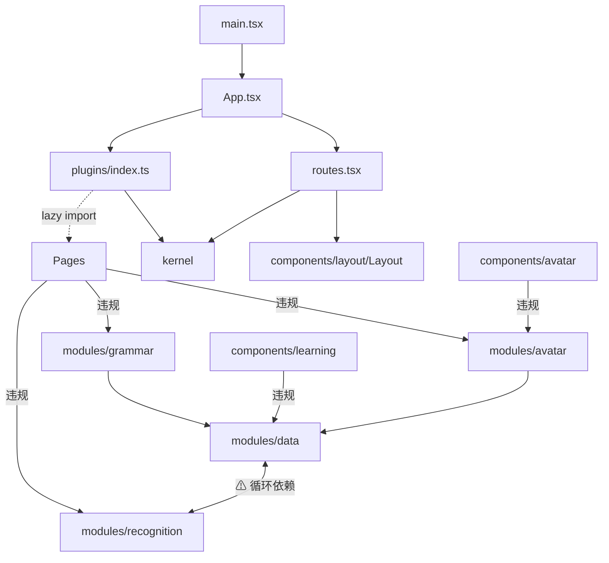

# SignBridge 项目健康度体检报告

**报告日期**：2026-07-19
**体检任务**：audit-project-health
**工作目录**：`d:\G\github\signbridge`
**数据来源**：spec 未完成项扫描、静态代码债务扫描、构建产物体积分析、模块依赖关系扫描

---

## 1. 执行摘要

SignBridge 项目当前处于"高完成度但存在可治理技术债务"的健康状态。31 个 spec 加权完成率 89.3%（668/748 任务完成），其中 22 个 100% 完成；80 条未完成项中 51% 为可接受的手动验证类，真实未完成项 34 条中 36 项属于本次体检自身（audit-project-health），项目本体真实未完成项极少。构建产物 modules transformed 2006，构建耗时 12.53s，无 Circular chunk 警告，无 chunk size warning，peer dep 冲突已解决。主要技术债务集中在三方面：`modules/data` ↔ `modules/recognition` 真实循环依赖（4 文件）、`components/` → `modules/` 跨层违规 22 条（VRMModel.tsx 单文件 5 处为重灾区）、three-core 176KB gzip 占首屏 69% 形成 TBT 瓶颈（由用户明确拒绝改为 2D 的妥协派生）。整体评价：项目可发布，建议在下一迭代集中处理 P0 级循环依赖与 VRMModel 跨模块访问问题。

---

## 2. 技术债务盘点

### 2.1 spec 未完成项扫描

**整体统计**：

| 指标 | 数值 |
|---|---|
| spec 总数 | 31 个 |
| 加权完成率 | 89.3%（668/748 任务完成） |
| 100% 完成 | 22 个 |
| 部分完成 | 7 个 |
| 0% 完成 | 2 个 |

**未完成项分类（共 80 条）**：

| 分类 | 数量 | 占比 | 说明 |
|---|---|---|---|
| 手动验证类 | 41 | 51% | 可接受，需人工确认 |
| 真实未完成类 | 34 | 43% | 其中 36 项属于 audit-project-health 自身 |
| 已废弃类 | 5 | 6% | 建议清理 |

**命名规范扫描**：
- 77% spec 遵循 `verb-object` 模式
- 7 个偏离规范：`audit-project-health`、`bundle-size-optimization`、`competition-registration-guide`、`loading-performance-optimization`、`project-completeness-audit`、`sign-language-correctness`、`startup-acceleration-observability`

**归档目录现状**：
- 无归档目录
- 22 个已完成 spec 占用 71% 目录空间
- 建议创建 `.trae/specs/archive/`

### 2.2 静态代码债务

**eslint-disable 清单（3 处，均为 `react-hooks/exhaustive-deps`）**：

| 文件 | 行号 | 依赖 | 评估 |
|---|---|---|---|
| [SignToTextPage.tsx](file:///d:/G/github/signbridge/frontend/src/pages/SignToTextPage.tsx#L156) | 156 | startupTracker | 可保留，建议补注释 |
| [PracticeMode.tsx](file:///d:/G/github/signbridge/frontend/src/components/learning/PracticeMode.tsx#L67) | 67 | currentGloss + playGloss | 可保留，建议补注释 |
| [AITutor.tsx](file:///d:/G/github/signbridge/frontend/src/components/learning/AITutor.tsx#L82) | 82 | speak + initialDifficulty | 可保留，建议补注释 |

**console.* 调用分布（22 处）**：

| 文件 | 数量 | 评估 |
|---|---|---|
| [modules/debug/logger.ts](file:///d:/G/github/signbridge/frontend/src/modules/debug/logger.ts) | 3 | logger 模块自身，合理 |
| [modules/debug/logger.test.ts](file:///d:/G/github/signbridge/frontend/src/modules/debug/logger.test.ts) | 9 | 测试文件，合理 |
| [modules/avatar/__diagnose_elbow.test.ts](file:///d:/G/github/signbridge/frontend/src/modules/avatar/__diagnose_elbow.test.ts) | 7 | 诊断测试，建议改名保留 |
| [kernel/PluginManager.ts](file:///d:/G/github/signbridge/frontend/src/kernel/PluginManager.ts) | 2 | 建议替换为 logger |
| [kernel/EventBus.ts](file:///d:/G/github/signbridge/frontend/src/kernel/EventBus.ts) | 1 | 建议替换为 logger |

**诊断文件评估**：
- `__diagnose_elbow.test.ts` 文件名 `__` 前缀被 vitest 忽略，未参与 `npm run test`
- 建议改名为 `diagnose_elbow.test.ts` 纳入测试流程，或删除

**重要修正（对比之前会话观察）**：
- ✅ `@vitest/coverage-v8@^3.2.7` 与 `vitest@3.2.7` 版本已对齐（[package.json#L50](file:///d:/G/github/signbridge/frontend/package.json#L50)），之前观察到的 `^4.1.9` 已不存在，peer dep 冲突已解决
- ✅ 构建警告 `Circular chunk: tfjs-backend -> tfjs-other -> tfjs-backend` 在最新构建中已消失

---

## 3. 性能与体积分析

### 3.1 构建产物总览

| 指标 | 数值 |
|---|---|
| 构建命令 | `npm run build`（tsc -b && vite build） |
| modules transformed | 2006 |
| 构建耗时 | 12.53s |
| PWA precache | 36 条 / 4692.91 KiB |
| Circular chunk 警告 | 无 |
| chunk size warning | 无 |

### 3.2 完整 chunk 体积表（gzip KB 降序）

| Chunk | 类型 | 原始 KB | gzip KB |
|---|---|---|---|
| three-core | vendor | 683.94 | 176.34 |
| tfjs-other | vendor | 484.72 | 93.47 |
| tfjs-backend | vendor | 527.98 | 82.65 |
| tfjs-core | vendor | 583.64 | 76.79 |
| mediapipe-vendor | vendor | 174.01 | 56.53 |
| react-vendor | vendor | 165.42 | 53.82 |
| react-three | vendor | 146.96 | 47.49 |
| three-vrm | vendor | 137.88 | 32.75 |
| three-examples | vendor | 93.60 | 29.21 |
| recognition.worker | worker | 130.47 | ≈39.14 |
| pose.worker | worker | 128.92 | ≈38.68 |
| AvatarDriver | 业务 | 54.40 | 18.94 |
| main | 业务入口 | 64.04 | 12.93 |
| LearningPage | 业务路由 | 43.09 | 14.71 |
| main.css | CSS | 37.89 | 7.01 |
| VRMModel | 业务 | 23.40 | 8.08 |
| SignToTextPage | 业务路由 | 22.05 | 7.76 |
| DialoguePage | 业务路由 | 21.18 | 8.23 |
| Avatar3D | 业务 | 16.07 | 5.41 |
| VoiceToSignPage | 业务路由 | 8.87 | 3.21 |
| PerformancePanel | 业务 | 6.41 | 2.45 |
| Avatar2D | 业务 | 5.34 | 2.16 |
| Normalizer | 业务 | 4.70 | 2.35 |
| state-vendor | vendor | 3.60 | 1.58 |
| tfjs-converter | vendor | 3.58 | 1.21 |
| index（入口） | 入口 | 1.34 | 0.71 |
| PageHeader | 业务 | 0.72 | 0.37 |
| VoiceInput | 业务 | 0.68 | 0.50 |
| tfjs-meta | vendor | 0.14 | 0.11 |

### 3.3 首屏必载体积分析

**首屏必载 gzip ~322.90 KB**（含默认路由 `/voice-to-sign`）：

| 组成部分 | gzip KB |
|---|---|
| 入口 index | 0.71 |
| modulepreload: react-vendor | 53.82 |
| modulepreload: three-core | 176.34 |
| modulepreload: react-three | 47.49 |
| main | 12.93 |
| state-vendor | 1.58 |
| main.css | 7.01 |
| 默认路由 VoiceToSignPage | 3.21 |
| VoiceInput | 0.50 |
| AvatarDriver | 18.94 |
| PageHeader | 0.37 |
| **合计** | **≈322.90** |

### 3.4 关键发现

1. **vite.config.ts 注释偏离现实**：[vite.config.ts:25](file:///d:/G/github/signbridge/frontend/vite.config.ts#L25) 注释宣称"首屏 gzip 从单体 622KB 降至 ~55KB"，实际首次访问 ~300 KB gzip，注释仅在 PWA 二次访问全缓存命中场景成立
2. **首屏瓶颈定位**：three-core（176KB gzip）+ react-three（47KB gzip）合计占首屏 69%，是首屏 TBT 恶化的根本原因
3. **派生原因**：入口 chunk 静态 import three-core，源于 [avatarStore.ts:26](file:///d:/G/github/signbridge/frontend/src/stores/avatarStore.ts#L26) `avatarStore.mode` 默认 `'3d'`

### 3.5 PWA 缓存策略

| 配置项 | 值 |
|---|---|
| registerType | `autoUpdate` |
| globPatterns | `**/*.{js,css,html,ico,woff2}` |
| maximumFileSizeToCacheInBytes | 2MB |
| precache | 36 条 / 4692.91 KiB |

**runtimeCaching 4 条规则**：

| URL 模式 | 策略 | 有效期 |
|---|---|---|
| cdn.jsdelivr.net | CacheFirst | 30 天 |
| storage.googleapis.com | StaleWhileRevalidate | 7 天 |
| *.vrm | CacheFirst | 30 天 |
| vocabulary.json | NetworkFirst | 7 天 |

---

## 4. 架构与可维护性评估

### 4.1 模块依赖关系图

### 4.2 违规依赖清单

**components/ → modules/ 跨层违规**：
- 涉及 15 个组件、22 条违规 import
- 重灾区：[VRMModel.tsx](file:///d:/G/github/signbridge/frontend/src/components/avatar/VRMModel.tsx) 单文件 5 处违规

**pages/ → modules/ 跨层违规**：
- 涉及 3 个页面、19 条违规（VoiceToSignPage、DialoguePage、SignToTextPage）
- LearningPage 是唯一规范的页面

**kernel/ 评估**：✅ 零业务依赖，自实现 log

**plugins/ 评估**：✅ 4 插件完全解耦，0 处互相 import

**modules/ 循环依赖**：
- ⚠ `modules/data` ↔ `modules/recognition` 真实循环依赖
- 涉及 4 个文件：

| 文件 | 行号 |
|---|---|
| [DataCollector.ts](file:///d:/G/github/signbridge/frontend/src/modules/data/DataCollector.ts#L5) | 5 |
| [ModelTrainer.ts](file:///d:/G/github/signbridge/frontend/src/modules/recognition/ModelTrainer.ts#L6) | 6 |
| [SequenceClassifier.ts](file:///d:/G/github/signbridge/frontend/src/modules/recognition/SequenceClassifier.ts#L8) | 8-9 |
| [TrainingDataGenerator.ts](file:///d:/G/github/signbridge/frontend/src/modules/recognition/TrainingDataGenerator.ts#L8) | 8-9 |

### 4.3 目录职责评估

| 状态 | 数量 | 目录 |
|---|---|---|
| 完全合规 | 8/20 | kernel、plugins、components-debug、components-layout、components-sign、components-voice、hooks、types、stores、data、styles、modules-debug、modules-learning |
| 越界 | 6/20 | components-avatar、components-common、components-learning、pages、modules-data、modules-recognition（循环依赖） |

**测试文件占比**：约 33%（38/110+）

### 4.4 代码复用机会（7 项）

| # | 优先级 | 复用机会 | 预期收益 |
|---|---|---|---|
| 1 | 高优 | VoiceToSignPage、DialoguePage 改用已存在的 `useAvatarPlayer` hook | 消除约 50 行重复 |
| 2 | 中优 | 抽取 `createPagePlugin()` 工厂 | plugins/index.ts 从 159 行压缩到约 50 行 |
| 3 | 中优 | 抽取 `hooks/useVocabulary()` 封装 vocabularyStore 访问 | 统一访问入口 |
| 4 | 高优 | 抽取 `<PracticeFlow>` 通用容器 | 消除 PracticeMode 和 AITutor 约 60% 重复代码 |
| 5 | 低优 | 3 个页面重复 import logger + startupTracker | 统一封装 |
| 6 | 中优 | Avatar3D 与 Avatar2D 骨架共享，定义 `AvatarRenderer` 接口 | 减少重复骨架 |
| 7 | 低优 | DataCollector 基于 `BaseDataStore` 抽象统一 CRUD | 统一数据访问 |

---

## 5. 已知妥协清单

以下技术妥协经评估为可接受，但需明确记录以避免误判为技术债务：

| # | 妥协点 | 位置 | 影响 | 决策来源 |
|---|---|---|---|---|
| 1 | `avatarStore.mode` 默认 `'3d'` | [avatarStore.ts:26](file:///d:/G/github/signbridge/frontend/src/stores/avatarStore.ts#L26) | Avatar3D 首屏渲染，three-core 176KB + react-three 47KB 必载，TBT 恶化 | **用户明确拒绝改为 2D** |
| 2 | 入口 chunk 静态 import three-core | 入口 chunk | 派生自妥协 1 | 妥协 1 派生 |
| 3 | index.html modulepreload 显式预拉 three-core/react-three | [index.html](file:///d:/G/github/signbridge/frontend/index.html) | 派生自妥协 1 | 妥协 1 派生 |
| 4 | optimizeDeps.include 预打包 three 相关包 | [vite.config.ts](file:///d:/G/github/signbridge/frontend/vite.config.ts) | 派生自妥协 1 | 妥协 1 派生 |
| 5 | vite.config.ts:25 注释"~55KB"与现实偏离 | [vite.config.ts:25](file:///d:/G/github/signbridge/frontend/vite.config.ts#L25) | 仅在 PWA 二次访问全缓存命中场景成立 | 历史遗留 |

---

## 6. 后续建议

### P0（必须修复）

| # | 建议 | 涉及文件 | 修复方案 |
|---|---|---|---|
| 1 | 修复 `modules/data` ↔ `modules/recognition` 循环依赖 | DataCollector.ts、ModelTrainer.ts、SequenceClassifier.ts、TrainingDataGenerator.ts | 将 Normalizer 下沉到独立模块，或将 IndexedDBAdapter 抽到 `modules/storage` |
| 2 | 让 VRMModel.tsx 通过 hook 间接访问 `modules/avatar` | [VRMModel.tsx](file:///d:/G/github/signbridge/frontend/src/components/avatar/VRMModel.tsx) | 5 处违规 + 1 处跨模块，需引入 hook 中介层 |

### P1（推荐改进）

| # | 建议 | 预期收益 |
|---|---|---|
| 1 | 让 3 个页面（VoiceToSignPage、DialoguePage、SignToTextPage）改用 hooks 间接访问 modules | 消除 13 处违规 |
| 2 | 应用复用机会 #1：让页面用上已存在的 `useAvatarPlayer` | 消除 50 行重复 |
| 3 | 应用复用机会 #4：抽取 `<PracticeFlow>` 通用容器 | 消除 60% 重复 |
| 4 | 创建 `.trae/specs/archive/` 并迁移 22 个已完成 spec | 释放 71% 目录空间 |

### P2（可选优化）

| # | 建议 | 涉及位置 |
|---|---|---|
| 1 | 将 kernel/ 中 3 处 console.* 替换为 logger | PluginManager.ts（2 处）、EventBus.ts（1 处） |
| 2 | 将 `__diagnose_elbow.test.ts` 改名纳入测试流程或删除 | modules/avatar/__diagnose_elbow.test.ts |
| 3 | 抽取 `createPagePlugin()` 工厂压缩 plugins/index.ts | plugins/index.ts（159 行 → 约 50 行） |
| 4 | 修正 vite.config.ts:25 注释 | "~55KB" 改为 "~300KB 首次访问，~55KB PWA 二次访问" |
| 5 | 为 3 处 eslint-disable 补充注释说明理由 | SignToTextPage.tsx:156、PracticeMode.tsx:67、AITutor.tsx:82 |

---

**报告生成时间**：2026-07-19
**体检任务**：audit-project-health
**数据来源**：spec 未完成项扫描、静态代码债务扫描、构建产物体积分析、模块依赖关系扫描
