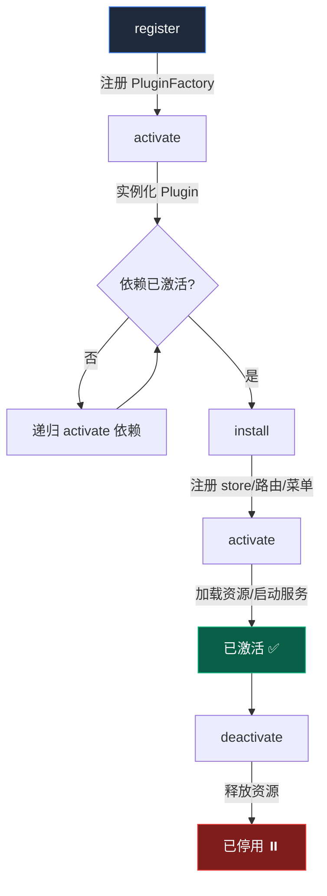
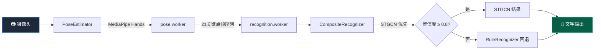
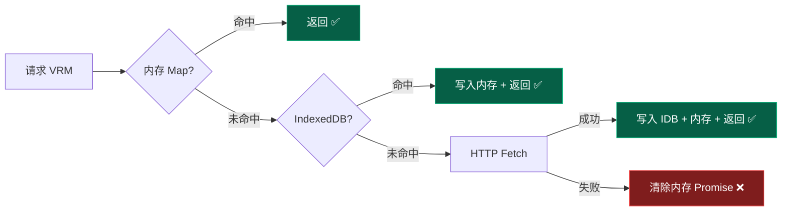
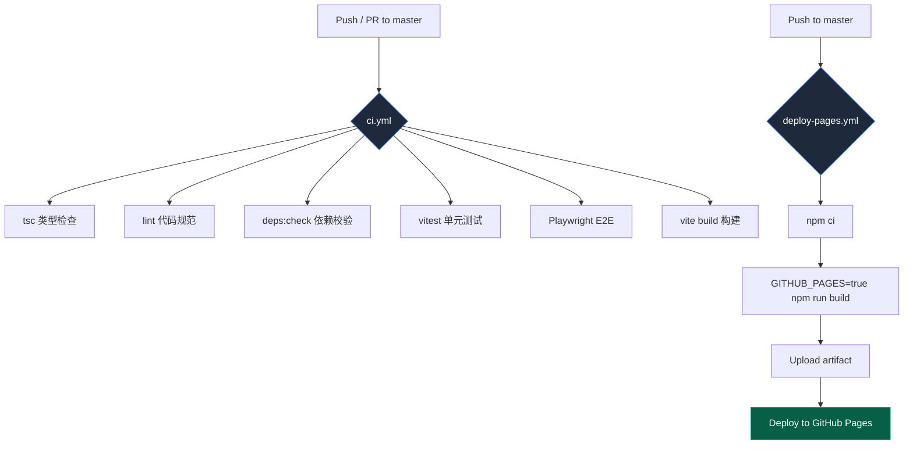
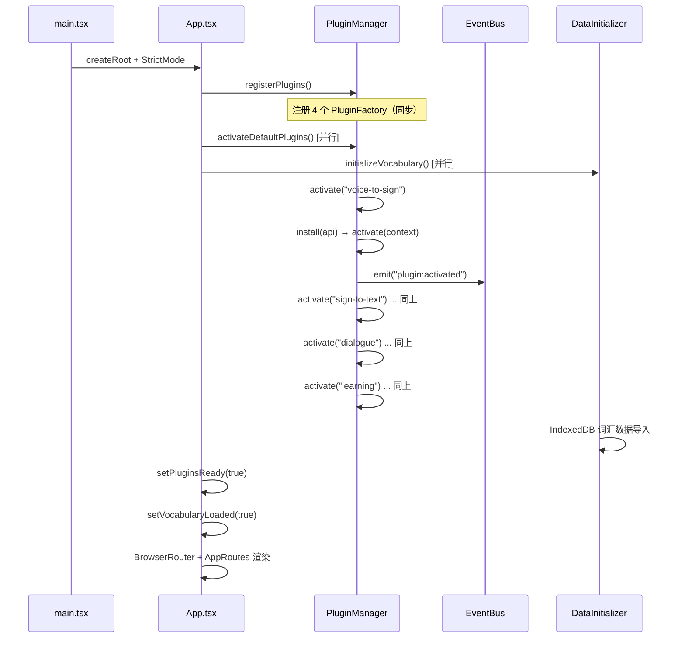

# SignBridge 技术架构说明

> **版本**：1.0.0 &nbsp;|&nbsp; **最后更新**：2026-07-19 &nbsp;|&nbsp; **内核版本**：1.0.0
>
> 本文档面向大赛评委（概览部分 3 分钟可懂全局）与开发者（后续细节可导航至其他分册）。

---

## 1. 项目概览

**一句话定位**：AI 驱动的双向手语翻译系统——让听障人士与健听人零障碍沟通。

### 核心功能

| 功能 | 符号 | 说明 |
|------|------|------|
| 语音转手语 | 🗣️→✋ | 语音输入经语法引擎生成 Gloss 序列，驱动 VRM 虚拟人渲染手语动画 |
| 手语识别 | ✋→📝 | 摄像头捕捉手部姿态，经 STGCN + 规则识别器输出文字 |
| 双向对话 | 🔄 | 语音→手语与手语→文字双通道并行，实时双向翻译 |
| 手语学习 | 📚 | 跟练模式下 DTW 对齐用户与标准动作，三维度评分反馈 |

### 目标用户

- **2700 万听障人士**：获取公共服务、在线交流的手语翻译工具
- **健听人家属**：学习手语、日常沟通的辅助手段
- **公共服务机构**：银行、医院、政务窗口的无障碍服务解决方案

---

## 2. 架构设计

### 2.1 微内核 + 插件化架构

系统采用 **微内核（Micro-Kernel）+ 插件化** 架构，内核仅提供插件生命周期管理和事件总线，所有业务功能以插件形式注册。

```
Kernel (PluginManager + EventBus)
  ├── voice-to-sign  语音转手语插件
  ├── sign-to-text   手语识别插件
  ├── dialogue       双向对话插件
  └── learning       手语学习插件
```

**选型理由**：

- **解耦**：路由、菜单、资源加载均由插件贡献，核心代码不依赖具体功能
- **可扩展**：新增功能只需定义一个 Plugin 并注册，无需修改 [routes.tsx](file:///d:/G/github/signbridge/frontend/src/routes.tsx) 或 Sidebar
- **按需加载**：插件组件使用 `React.lazy` 懒加载，首屏仅拉取必要资源
- **故障隔离**：单个插件激活失败不阻塞其他插件

### 2.2 插件生命周期



### 2.3 插件接口

定义于 [types.ts](file:///d:/G/github/signbridge/frontend/src/kernel/types.ts)：

```typescript
interface Plugin {
  manifest: PluginManifest;          // 清单：名称/版本/路由/菜单/依赖
  install(api: KernelAPI): Promise<void>;   // 注册 store、路由、菜单
  activate(context: PluginContext): Promise<void>; // 加载资源、启动服务
  deactivate?(): void;              // 释放资源（可选）
}

interface PluginManifest {
  name: string;              // 唯一标识
  version: string;           // 版本号
  displayName?: string;      // 显示名称
  routes?: RouteConfig[];    // 贡献的路由
  menuItems?: MenuConfig[];  // 贡献的菜单项
  dependencies?: string[];   // 依赖的其他插件
  activeByDefault?: boolean; // 是否默认激活
}
```

### 2.4 内核 API

`KernelAPI` 是内核暴露给插件的接口，定义于 [types.ts](file:///d:/G/github/signbridge/frontend/src/kernel/types.ts)：

| 方法 | 说明 |
|------|------|
| `registerStore(name, store)` | 注册 Zustand store |
| `getStore(name)` | 获取已注册的 store |
| `registerRoute(route)` | 注册路由 |
| `registerMenuItem(item)` | 注册菜单项 |
| `on/off/emit` | 事件总线订阅/取消/发布 |
| `getPlugin(name)` | 获取已激活的插件实例 |
| `getInfo()` | 获取内核版本与活跃插件列表 |

### 2.5 关键源文件

| 文件 | 职责 |
|------|------|
| [PluginManager.ts](file:///d:/G/github/signbridge/frontend/src/kernel/PluginManager.ts) | 插件注册/激活/停用/依赖解析，全局单例 |
| [EventBus.ts](file:///d:/G/github/signbridge/frontend/src/kernel/EventBus.ts) | 轻量级发布订阅，跨插件通信，全局单例 |
| [types.ts](file:///d:/G/github/signbridge/frontend/src/kernel/types.ts) | Plugin/KernelAPI/RouteConfig/MenuConfig 类型定义 |
| [plugins/index.ts](file:///d:/G/github/signbridge/frontend/src/plugins/index.ts) | 4 个内置插件定义与注册 |
| [routes.tsx](file:///d:/G/github/signbridge/frontend/src/routes.tsx) | 从 pluginManager 动态聚合路由 |
| [App.tsx](file:///d:/G/github/signbridge/frontend/src/App.tsx) | 内核启动 + 路由容器 + 数据初始化 |

---

## 3. 模块关系与数据流

### 3.1 六大核心模块

| 模块 | 目录 | 职责 |
|------|------|------|
| **avatar** | `modules/avatar/` | VRM 虚拟人渲染：ClipBuilder → MotionPlayer → Three.js |
| **recognition** | `modules/recognition/` | 手语识别：PoseEstimator → CompositeRecognizer → 文字 |
| **grammar** | `modules/grammar/` | 语法引擎：Tokenizer → Rewriter → GlossMapper → NonManualMarker |
| **data** | `modules/data/` | 数据层：IndexedDB 持久化、词汇库管理 |
| **learning** | `modules/learning/` | 学习模式：DTW 时间对齐 + 三维度评分 |
| **debug** | `modules/debug/` | 调试工具：日志、启动追踪器、性能面板 |

### 3.2 语音→手语 数据流


**关键环节**：

1. **GrammarEngine**（[GrammarEngine.ts](file:///d:/G/github/signbridge/frontend/src/modules/grammar/GrammarEngine.ts)）：中文文本 → GlossSequence，四阶段流水线
2. **ClipBuilder**（[ClipBuilder.ts](file:///d:/G/github/signbridge/frontend/src/modules/avatar/ClipBuilder.ts)）：Gloss → `THREE.AnimationClip`，内部调用 IKSolver 计算肩肘旋转
3. **MotionPlayer**（[MotionPlayer.ts](file:///d:/G/github/signbridge/frontend/src/modules/avatar/MotionPlayer.ts)）：`AnimationMixer` 驱动 VRM 骨骼播放，支持缓动插值与变速

### 3.3 手语→文字 数据流



**关键环节**：

1. **PoseEstimator**（[PoseEstimator.ts](file:///d:/G/github/signbridge/frontend/src/modules/recognition/PoseEstimator.ts)）：封装 MediaPipe PoseLandmarker + HandLandmarker，Web Worker 异步推理
2. **CompositeRecognizer**（[CompositeRecognizer.ts](file:///d:/G/github/signbridge/frontend/src/modules/recognition/CompositeRecognizer.ts)）：按优先级级联 STGCN + Rule，置信度不足时自动回退
3. **Worker 双线程**：[pose.worker.ts](file:///d:/G/github/signbridge/frontend/src/modules/recognition/pose.worker.ts) + [recognition.worker.ts](file:///d:/G/github/signbridge/frontend/src/modules/recognition/recognition.worker.ts)，主线程不阻塞

### 3.4 学习模式 数据流


**关键环节**：

1. **DTW**（[DTW.ts](file:///d:/G/github/signbridge/frontend/src/modules/learning/DTW.ts)）：动态时间规整，Sakoe-Chiba 带状约束防止病态对齐
2. **Scoring**（[Scoring.ts](file:///d:/G/github/signbridge/frontend/src/modules/learning/Scoring.ts)）：手形(0.4) + 位置(0.4) + 运动方向(0.2) 三维度加权评分

---

## 4. 技术栈选型

| 技术 | 用途 | 为什么选它 | 替代方案 |
|------|------|-----------|---------|
| React 18 + TypeScript | UI 框架 | 组件化 + 类型安全，生态成熟 | Vue 3, Svelte |
| Three.js + @pixiv/three-vrm | 3D 渲染 | VRM 格式原生支持，VRM-1.0 规范兼容 | Babylon.js, PlayCanvas |
| MediaPipe Hands | 手部检测 | 21 关键点实时检测，浏览器端推理 | OpenPose + Server |
| TensorFlow.js | 模型推理 | STGCN 时空图卷积浏览器端运行，WebGL 加速 | ONNX Runtime Web |
| Zustand | 状态管理 | 轻量（~1KB），无 Provider 包裹，TypeScript 友好 | Redux, Jotai |
| IndexedDB | 本地存储 | 大容量结构化存储，离线可用，VRM 模型缓存 | localStorage, OPFS |
| Vite + PWA | 构建工具 | 极速 HMR，原生 ESM，内置 PWA 插件 | Webpack, Rspack |
| Web Workers | 多线程 | 姿态估计与识别推理不阻塞主线程渲染 | SharedArrayBuffer |

---

## 5. 关键设计决策

### 5.1 纯前端无后端

**决策**：所有计算在浏览器端完成，无需服务器。

**理由**：
- **部署成本为零**：GitHub Pages 静态托管，零运维
- **离线可用**：PWA Service Worker 缓存核心资源，断网仍可使用
- **隐私保护**：用户视频帧不离开设备，对听障场景尤为重要

**代价**：模型推理受客户端算力限制，STGCN 推理帧率依赖 GPU 性能。

### 5.2 Normalized Bone API

**决策**：ClipBuilder 使用 `humanoid.getNormalizedBoneNode()` 而非直接操作 raw bone。

**理由**：VRM 的 `autoUpdateHumanBones` 默认为 true，`VRM.update()` 会将 normalized bone 同步到 raw bone。若 AnimationMixer 直接操作 raw bone，其修改会被 `vrm.update()` 覆盖（normalized bone 仍为 identity），导致模型不动。改用 normalized bone 后，AnimationMixer 的旋转由 `vrm.update()` 正确同步到 raw bone。

详见 [ClipBuilder.ts](file:///d:/G/github/signbridge/frontend/src/modules/avatar/ClipBuilder.ts) 顶部注释。

### 5.3 IK_MODE 编译时常量

**决策**：IK 求解路径通过 `IKMode` 类型在编译时确定，默认 `analytic`。

```typescript
type IKMode = 'analytic' | 'fabrik' | 'constraint';
```

| 模式 | 算法 | 适用场景 |
|------|------|---------|
| `analytic` | 余弦定理解析法 | 默认，最快 |
| `fabrik` | FABRIK 迭代求解 | 需要更自然姿态时 |
| `constraint` | FABRIK + VRMC 约束 | VRMC_node_constraint 后处理 |

**理由**：避免运行时切换的性能开销。后续可通过 `import.meta.env.VITE_IK_MODE` 支持运行时配置。

### 5.4 ExpressionManager 代理对象

**决策**：创建代理对象桥接 AnimationMixer 与 VRM blendShape。

**理由**：AnimationMixer 只能驱动 `THREE.PropertyMixer`（骨骼旋转轨道），无法直接驱动 VRM 的 `blendShapeProxy`。代理对象将 AnimationClip 中的表情轨道映射到 `VRM.expressionManager.setValue()`，实现表情与骨骼动画的统一时间轴驱动。

### 5.5 Worker 双线程

**决策**：姿态估计与手语识别分别在独立 Web Worker 中运行。

| Worker | 文件 | 职责 |
|--------|------|------|
| pose.worker | [pose.worker.ts](file:///d:/G/github/signbridge/frontend/src/modules/recognition/pose.worker.ts) | MediaPipe 帧推理，输出 21 关键点 |
| recognition.worker | [recognition.worker.ts](file:///d:/G/github/signbridge/frontend/src/modules/recognition/recognition.worker.ts) | STGCN 时序推理 + 规则匹配 |

**理由**：MediaPipe 推理单帧 ~15ms，STGCN 推理 ~30ms，若在主线程运行将导致 60fps 渲染帧率跌至 ~20fps。Worker 线程与主线程通过 `postMessage` 通信，关键点数据使用 Transferable 零拷贝传输。

---

## 6. 性能策略

### 6.1 分包策略

通过 `manualChunks` 将 vendor 依赖拆分为 **11 个独立 chunk**，首屏仅加载必需 chunk：

| Chunk | 内容 | 加载时机 |
|-------|------|---------|
| `react-vendor` | React + ReactDOM + React Router | 首屏必载 |
| `three-core` | Three.js 核心 | 语音转手语页 |
| `three-examples` | GLTFLoader/FBXLoader 等 | 语音转手语页 |
| `three-vrm` | @pixiv/three-vrm | 语音转手语页 |
| `react-three` | @react-three/fiber + drei | 语音转手语页 |
| `tfjs-core` | @tensorflow/tfjs-core | 手语识别页 |
| `tfjs-backend` | tfjs-backend-webgl | 手语识别页 |
| `tfjs-converter` | tfjs-converter | 手语识别页 |
| `tfjs-other` | 其他 @tensorflow/* | 手语识别页 |
| `mediapipe-vendor` | @mediapipe/* | 手语识别/学习页 |
| `state-vendor` | Zustand | 首屏必载 |

**效果**：首屏 gzip 从单体 **622KB** 降至 **~55KB**（仅 react-vendor + state-vendor + 业务代码）。

详见 [vite.config.ts](file:///d:/G/github/signbridge/frontend/vite.config.ts) 中 `manualChunks` 配置。

### 6.2 PWA 离线策略

配置于 [vite.config.ts](file:///d:/G/github/signbridge/frontend/vite.config.ts) 中 `VitePWA` 插件：

| 策略 | 范围 | 说明 |
|------|------|------|
| 预缓存 | `**/*.{js,css,html,ico,woff2}` | 核心静态资源，安装时缓存 |
| CacheFirst | `cdn.jsdelivr.net` | CDN 资源，30 天缓存 |
| StaleWhileRevalidate | `storage.googleapis.com` | 模型文件，后台更新 |
| CacheFirst | `*.vrm` | VRM 模型，30 天缓存 |
| NetworkFirst | `vocabulary.json` | 词汇数据，优先网络，离线降级 |

**排除**：`vocabulary.json`、`*.vrm`、`pwa-*.png` 不纳入预缓存（体积大/按需使用），由 `runtimeCaching` 管理。

### 6.3 VRM 三级缓存

[VRMCache.ts](file:///d:/G/github/signbridge/frontend/src/modules/avatar/VRMCache.ts) 实现三级加载策略：



**设计要点**：
- 内存缓存为 `Map<string, Promise<VRM>>`，避免 React StrictMode 双重渲染重复加载
- IDB 缓存含版本号，升级模型解析逻辑时递增以作废旧缓存
- 所有 IDB 操作 `try-catch`，失败不阻塞加载流程

### 6.4 路由预加载与骨架屏

| 策略 | 实现 |
|------|------|
| React.lazy + Suspense | 每个页面组件懒加载，Suspense 回退为 `MainContentSkeleton` |
| Sidebar 预加载 | 用户 hover Sidebar 菜单项时 `prefetch` 对应 chunk |
| Critical CSS 内联 | 关键渲染路径样式内联至 HTML，避免 FOUC |
| PageSkeleton | 启动期渲染骨架屏（视觉接近真实布局），减少布局抖动 |

---

## 7. 部署架构

### 7.1 托管方案

- **平台**：GitHub Pages（静态站点托管）
- **Base 路径**：`/signbridge/`（由环境变量 `GITHUB_PAGES` 控制）

```typescript
// vite.config.ts
base: process.env.GITHUB_PAGES ? '/signbridge/' : '/',
```

### 7.2 CI/CD 流水线



### 7.3 CI 配置详情（[ci.yml](file:///d:/G/github/signbridge/.github/workflows/ci.yml)）

| 步骤 | 命令 | 说明 |
|------|------|------|
| 类型检查 | `npx tsc --noEmit -p tsconfig.app.json` | 全量 TypeScript 类型校验 |
| 代码规范 | `npm run lint` | ESLint + Prettier |
| 依赖校验 | `npm run deps:check` | 模块依赖架构规则校验 |
| 单元测试 | `npm run test` | Vitest 单元测试 |
| E2E 测试 | `npx playwright test` | Playwright 端到端测试 |
| 构建 | `npm run build` | Vite 生产构建 |

### 7.4 部署配置详情（[deploy-pages.yml](file:///d:/G/github/signbridge/.github/workflows/deploy-pages.yml)）

| 配置项 | 值 | 说明 |
|--------|-----|------|
| 触发条件 | `push to main/master` + `workflow_dispatch` | 自动部署 + 手动触发 |
| Node.js 版本 | 24 | 支持 Vite 6 + ES2024 |
| 构建环境变量 | `GITHUB_PAGES=true` | 控制 base 路径为 `/signbridge/` |
| 并发控制 | `cancel-in-progress: false` | 不取消正在进行的部署 |
| 权限 | `pages: write` + `id-token: write` | GitHub Pages 部署所需最小权限 |

### 7.5 环境变量

| 变量 | 位置 | 说明 |
|------|------|------|
| `GITHUB_PAGES` | CI/部署 | 控制构建 base 路径 |
| `VITE_MEDIAPIPE_WASM_BASE_URL` | `.env` | MediaPipe tasks-vision wasm 目录 |
| `VITE_MEDIAPIPE_HANDS_CDN_BASE` | `.env` | MediaPipe Hands 旧版 wasm CDN 基址 |
| `VITE_GESTURE_MODEL_URL` | `.env` | 预训练手势识别模型 URL |
| `VITE_GESTURE_LIBRARY_URL` | `.env` | 默认手势库 JSON 路径 |
| `VITE_VOCABULARY_URL` | `.env` | 词汇库 JSON 路径 |
| `VITE_APP_NAME` | `.env` | 应用显示名称 |

所有配置集中管理于 [config.ts](file:///d:/G/github/signbridge/frontend/src/config.ts)，切换 CDN/自托管模型只需改 `.env`，无需改代码。

---

## 附录：启动时序



> 📖 **导航**：本文为技术架构总览。如需深入各模块实现细节，请参阅：
> - 模块详细设计 → `docs/technical/02-modules.md`
> - API 接口规范 → `docs/technical/03-api.md`
> - 性能优化实测 → `docs/technical/04-performance.md`
