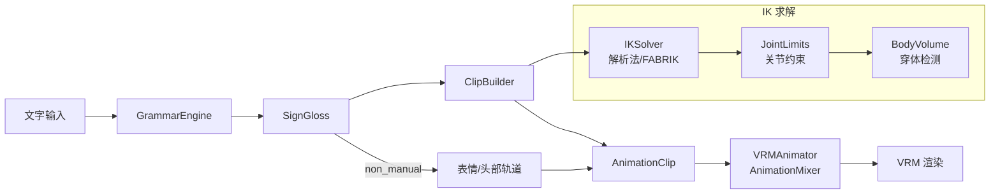
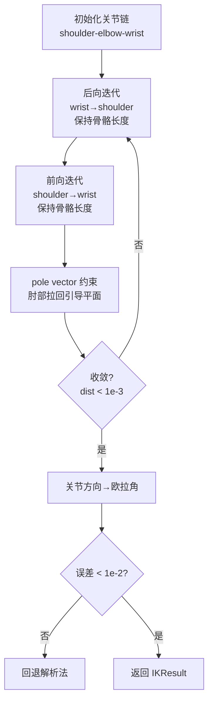
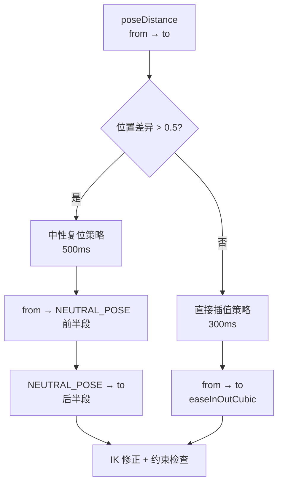
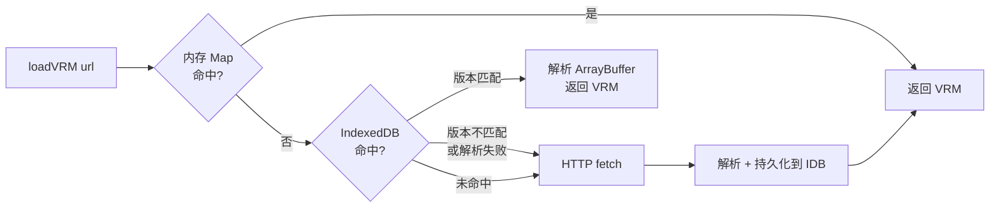

# 02 Avatar 模块 — 技术说明

## 1. 模块概览

Avatar 模块是 SignBridge 的 3D 虚拟人驱动核心，将手语语言学描述自动转换为 VRM 角色的骨骼动画。完整管线如下：



**技术亮点：**

- **双轨 IK**：编译时可切换解析法（余弦定理）与 FABRIK 迭代法，解析法默认启用，精度达 9.7e-4 误差级别
- **穿体修正**：躯干椭圆柱体 + 头部球体的碰撞检测，手腕/肘部穿入时自动投影到包络表面
- **表情代理对象**：通过 `Object3D` + `defineProperty` 代理 `expressionManager`，使 `AnimationMixer` 能驱动 VRM BlendShape
- **normalized bone API**：使用 `getNormalizedBoneNode` 而非 `getRawBoneNode`，避免 `vrm.update()` 覆盖动画数据
- **21 种运动轨迹**：覆盖中国手语全部运动模式，TAP 系列用正弦波替代离散跳变

### 模块文件清单

| 文件 | 职责 |
|------|------|
| [ClipBuilder.ts](file:///d:/G/github/signbridge/frontend/src/modules/avatar/ClipBuilder.ts) | 关键帧构建器，SignGloss → AnimationClip |
| [HandShape.ts](file:///d:/G/github/signbridge/frontend/src/modules/avatar/HandShape.ts) | 18 种手形定义与插值 |
| [IKSolver.ts](file:///d:/G/github/signbridge/frontend/src/modules/avatar/IKSolver.ts) | 解析法 + FABRIK IK 求解器 |
| [JointLimits.ts](file:///d:/G/github/signbridge/frontend/src/modules/avatar/JointLimits.ts) | 关节角度约束与 VRMC 适配 |
| [BodyVolume.ts](file:///d:/G/github/signbridge/frontend/src/modules/avatar/BodyVolume.ts) | 躯干包络体与穿体检测 |
| [MotionPlayer.ts](file:///d:/G/github/signbridge/frontend/src/modules/avatar/MotionPlayer.ts) | 旧 BonePose 轨道动作播放器 |
| [TransitionEngine.ts](file:///d:/G/github/signbridge/frontend/src/modules/avatar/TransitionEngine.ts) | 动作间过渡策略引擎 |
| [VRMAdapter.ts](file:///d:/G/github/signbridge/frontend/src/modules/avatar/VRMAdapter.ts) | VRM 模型加载与骨骼驱动 |
| [VRMAnimator.ts](file:///d:/G/github/signbridge/frontend/src/modules/avatar/VRMAnimator.ts) | AnimationMixer 封装与表情代理 |
| [VRMCache.ts](file:///d:/G/github/signbridge/frontend/src/modules/avatar/VRMCache.ts) | 三级缓存（内存→IndexedDB→HTTP） |
| [AvatarDriver.ts](file:///d:/G/github/signbridge/frontend/src/modules/avatar/AvatarDriver.ts) | 驱动器主类，编排双轨播放 |
| [KalidokitSolver.ts](file:///d:/G/github/signbridge/frontend/src/modules/avatar/KalidokitSolver.ts) | Kalidokit 实时姿态解算 |
| [RealtimePoseDriver.ts](file:///d:/G/github/signbridge/frontend/src/modules/avatar/RealtimePoseDriver.ts) | 实时摄像头驱动管线 |
| [Smoother.ts](file:///d:/G/github/signbridge/frontend/src/modules/avatar/Smoother.ts) | One-Euro Filter 平滑器 |
| [MixamoRetargeter.ts](file:///d:/G/github/signbridge/frontend/src/modules/avatar/MixamoRetargeter.ts) | Mixamo FBX→VRM 重定向 |
| [EnumParser.ts](file:///d:/G/github/signbridge/frontend/src/modules/avatar/EnumParser.ts) | 枚举字符串安全解析 |
| [skeleton/joints.ts](file:///d:/G/github/signbridge/frontend/src/modules/avatar/skeleton/joints.ts) | 关节名与约束常量 |
| [skeleton/Skeleton2D.ts](file:///d:/G/github/signbridge/frontend/src/modules/avatar/skeleton/Skeleton2D.ts) | 2D 骨架绘制 |
| [skeleton/Skeleton3D.ts](file:///d:/G/github/signbridge/frontend/src/modules/avatar/skeleton/Skeleton3D.ts) | 3D 正向运动学 |

---

## 2. ClipBuilder — 关键帧构建器

ClipBuilder 是模块的核心，负责将 SignGloss 转换为 THREE.AnimationClip。入口方法 `ClipBuilder.buildClip(gloss, vrm)` 返回包含多条关键帧轨道的完整动画片段。

### 2.1 输入与输出

- **输入**：[SignGloss](file:///d:/G/github/signbridge/frontend/src/types/sign.ts)，包含 `manual`（手形、位置、运动、掌向）和 `non_manual`（表情、头部动作）
- **输出**：`THREE.AnimationClip`，轨道包括：肩/肘/腕四元数轨道（每臂 3 条）、手指骨四元数轨道（每手 15 条）、表情数值轨道、头部动作轨道

### 2.2 手形系统

[HandShape](file:///d:/G/github/signbridge/frontend/src/types/sign.ts) 定义 18 种枚举值（`FLAT_B`、`FIST_A`、`OPEN_5`、`INDEX_POINT`、`V_SHAPE`、`THUMB_UP`、`C_SHAPE`、`O_SHAPE`、`HORNS`、`THREE`/`FOUR`/`SIX`~`TEN`、`HOOK` 等）。

映射链路：`HandShape` 枚举 → `getHandShapeDefinition()` 查表 → `HandShapeDefinition`（5 指 × `FingerPose`）→ VRM 指骨旋转

每个 `FingerPose` 含三关节角度（mcp/pip/dip，弧度），以及可选的 Y 轴外展（mcpY/pipY/dipY）和 Z 轴旋转。手指旋转在 [ClipBuilder.buildFingerTracks](file:///d:/G/github/signbridge/frontend/src/modules/avatar/ClipBuilder.ts) 中转为 `Euler(startX, startY * sideSign, startZ, 'XYZ')` 四元数，左手 Y 取反实现镜像。

### 2.3 手部位置

`HandLocation` 13 区 → `LOCATION_OFFSETS` 映射（相对 hips 偏移，标准人体比例）：

| 位置 | X | Y | Z |
|------|-----|------|------|
| NEUTRAL | 0* | -0.10 | 0.18 |
| WAIST_LEVEL | 0 | 0.10 | 0.20 |
| CHEST_CENTER | 0 | 0.35 | 0.25 |
| SHOULDER_LEFT/RIGHT | ±0.22 | 0.50 | 0.12 |
| FACE_LEVEL | 0 | 0.63 | 0.28 |
| EYE_LEVEL | 0 | 0.66 | 0.26 |
| FOREHEAD_LEVEL | 0 | 0.70 | 0.22 |

\* NEUTRAL 的 X 按主导手调整（左 -0.20 / 右 +0.20）

### 2.4 运动轨迹

`Movement` 21 种枚举 → `buildMovementTrajectory` 生成 5~8 个轨迹点（时间 + 位置）：

| 类型 | 枚举值 | 采样点 | 算法 |
|------|--------|--------|------|
| 静止/线性 | STATIC, UPWARD, HORIZONTAL_LINE 等 | 8 | 线性插值 |
| 弧线 | UPWARD_ARC, DOWNWARD_ARC | 8 | 线性 + Y 抛物线偏移 `4t(1-t)` |
| 圆形 | CIRCULAR | 8 | XZ 平面圆弧插值 |
| 之字形 | ZIGZAG | 6 | 折线 X 交替偏移 |
| 摆动 | WAVE, SIDE_TO_SIDE | 8 | X 叠加正弦波 2 周期 |
| 点触 | TAP | 8 | 半正弦波 `amp·sin(πt)`，z 连续 0→amp→0 |
| 双击 | TAP_TWICE | 8 | 全正弦绝对值 `amp·|sin(2πt)|` |
| 勾连 | HOOK_TOGETHER | 5 | X 趋 0，Y 下降 |

**TAP 正弦波平滑化**：旧实现用 5 个离散点（start→contact→start→contact→start），z 跳变 0.1m 导致 IK 解在两个截然不同的肘部姿态间跳变（signedAngle 差 >70°）。改用半正弦波后 z 连续变化，IK 解平滑过渡，物理语义也更接近真实手语惯性。

### 2.5 表情驱动

`FacialExpression` → `EXPRESSION_MAP` → `expressionManager` 代理对象。

**为什么需要代理对象**：`AnimationMixer` 通过 `PropertyBinding` 解析轨道名 `expressionManager.happy`，需要场景中存在名为 `expressionManager` 的 `Object3D` 并具有 `happy` 属性。但 VRM 的 `expressionManager` 不是 `Object3D`，无法被 `PropertyBinding` 直接发现。解决方案在 VRMAnimator 构造函数中创建代理 `Object3D`，通过 `defineProperty` 将 getter/setter 转发到 `vrm.expressionManager.getValue()/setValue()`。

### 2.6 IK 求解

IK_MODE 编译时常量（`type IKMode = 'analytic' | 'fabrik' | 'constraint'`，默认 `'analytic'`）：

**解析法**（`solveArmQuaternions`）：

1. 余弦定理计算肩部抬升角：`cosLift = (L1² + dist² - L2²) / (2·L1·dist)`
2. 肘引导方向基于 `hipsDir` 动态推导，投影到垂直于 `dir` 的平面
3. 上臂方向几何公式：`upperArmDir = dir·cos(shoulderLift) + elbowDir·sin(shoulderLift)`
4. `setFromUnitVectors(upperRestDir, upperArmDir)` 构造肩部四元数
5. 肘部穿透检测 → `projectToSurface` 修正
6. 前臂方向 → 肩本地坐标 → 肘部四元数
7. 关节约束（`constrainShoulderByDirection` + `constrainHingeJoint` + `constrainForearmRotation`）
8. VRMC 约束后处理

### 2.7 坐标转换

`offsetToSceneLocalTarget` 将"相对 hips 偏移"转为"scene 本地坐标"：

- X 轴取反：模型面朝 +Z 时右手边是 -X，`LOCATION_OFFSETS` 的 X 正值表示右侧 → 取反
- Y 分区间缩放：`y ≤ 0.50` 按 `shoulderY/STANDARD_SHOULDER_Y` 缩放；`y > 0.50` 在 `[肩, 头顶]` 区间插值
- Z 不取反：模型朝 +Z，与 `LOCATION_OFFSETS` 的 Z 正值一致

### 2.8 时序平滑后处理

IK 对每个轨迹点独立求解，当目标跨越奇异点时 `setFromUnitVectors` 的最短旋转选择可能跳到另一分支。后处理检测相邻帧旋转差异 >60° 的跳变帧，用前一帧 SLERP 插值（t=0.5）替代，保持时序连续性。

---

## 3. IKSolver — FABRIK 迭代求解器

### 算法流程



### 关键参数

- **迭代次数**：默认 10 次
- **收敛判定**：wrist 到目标距离 < 1e-3（距离平方 < 1e-6）
- **最终误差检查**：> 1e-2 时回退到解析法 `solve()`

### pole vector 约束

`applyPoleConstraint` 将肘部旋转到 shoulder→wrist 轴与 poleDir 构成的平面。退化处理：当肘部落落在轴上（径向距离 ≈ 0），用海伦公式求三角形高度作为偏移量，使肘部获得初始弯曲。

### 与解析法的对比

FABRIK 输出欧拉角（含 Y/Z 分量），解析法的铰链约束强制 Y/Z=0。FABRIK 保留更多自由度，在极端姿态下可能更自然，但也可能导致前臂扭转。两种方法最终误差均 ≤ 9.7e-4。

---

## 4. JointLimits — 关节约束

### 4.1 铰链轴计算

`computeHingeAxis(boneRestDir, referenceDir)`：叉积 `boneRestDir × referenceDir`，垂直于骨骼方向与参考方向构成的平面。

**A-pose 退化处理**：当 `upperRestDir ≈ (0,-1,0)` 与 `UP=(0,1,0)` 平行时，叉积长度 < 1e-6，回退到正交参考方向——优先 `(1,0,0)`，若 `boneRestDir` 接近 ±X 则用 `(0,0,1)`。

### 4.2 约束函数

| 函数 | 关节类型 | 约束范围 |
|------|----------|----------|
| `constrainShoulderByDirection` | 球窝关节 | 外展 ≤120° / 前屈 ≤180° / 后伸 ≤60° |
| `constrainHingeJoint` | 铰链关节 | 肘屈曲 0°~150° |
| `constrainForearmRotation` | 前臂旋转 | 旋前/旋后 ±80° |
| `applyVRMCConstraints` | VRMC roll | 按 rollWeight 分布扭转到子骨骼 |

### 4.3 肩关节方向感知约束

`constrainShoulderByDirection` 自动适配 T-pose/A-pose：
- **T-pose**（`|rest.y| < 0.5`）：外展看 Y 分量变化，前屈/后伸看 Z 分量
- **A-pose**（`|rest.y| ≥ 0.5`）：外展看 |X| 分量变化，前屈/后伸看 Z 分量

### 4.4 VRMC_node_constraint 适配

`applyVRMCConstraints` 当前仅支持 roll 约束：将 upperArm 绕 rollAxis 的旋转按 `rollWeight` 比例分布到 lowerArm，避免上臂大幅扭转时前臂不动导致肘部突变。约束缓存由 `VRMConstraintMap`（WeakMap\<VRM, Map\>）管理，VRM 加载时填充，buildClip 时读取。

---

## 5. MotionPlayer — 动作播放器

管理旧 BonePose 轨道的播放生命周期：

- **播放**：`play(motion, onComplete)` 设置数据、重置时间、初始化为第一帧
- **更新**：`update(deltaTime)` 推进时间，二分查找帧区间，`easeInOutCubic` 缓动插值
- **停止/暂停/恢复**：标准生命周期管理
- **变速**：`setSpeed(speed)` 调整时间推进倍率
- **SignMotion 新轨道**：`playMotion(motion)` + `getPoseAt(timeMs)` 在关键帧间 `easeInOutCubic` 缓动插值

---

## 6. TransitionEngine — 过渡引擎

### 过渡策略



**策略选择依据**：当两个姿态的手腕位置差异过大（>0.5m）时，直接插值会导致手臂穿过躯干，因此先回到中性位置再过渡到目标。

每帧过渡均经过 `applyIKCorrection`（IK 反算肩肘旋转）和 `clampJointAngles`（关节角度约束检查）。

---

## 7. VRMAdapter — VRM 适配器

### VRM 模型加载

使用 `GLTFLoader` + `VRMLoaderPlugin` 加载标准 VRM 文件，支持加载进度回调与资源释放。

### normalized bone API

```
getNormalizedBoneNode('leftUpperArm')  ← 使用此 API
getRawBoneNode('leftUpperArm')         ← 不要使用
```

**原因**：VRM 的 `autoUpdateHumanBones` 默认为 true，`vrm.update()` 会把 normalized bone 同步到 raw bone。若 `AnimationMixer` 直接操作 raw bone，其修改会被 `vrm.update()` 覆盖（normalized bone 未被修改仍是 identity），导致模型不动。改用 normalized bone 后，`AnimationMixer` 操作 normalized bone，`vrm.update()` 会正确同步到 raw bone。

### 表情代理对象

在 [VRMAnimator](file:///d:/G/github/signbridge/frontend/src/modules/avatar/VRMAnimator.ts) 构造函数中创建：

```typescript
const exprProxy = new THREE.Object3D();
exprProxy.name = 'expressionManager';
for (const preset of ['happy', 'sad', 'angry', 'surprised', 'relaxed']) {
  Object.defineProperty(exprProxy, preset, {
    get: () => vrm.expressionManager?.getValue(preset) ?? 0,
    set: (v: number) => vrm.expressionManager?.setValue(preset, v),
  });
}
vrm.scene.add(exprProxy);
```

`AnimationMixer` 的 `PropertyBinding` 解析轨道名 `expressionManager.happy` 时，找到该代理对象并设置 `happy` 属性，setter 转发到 `vrm.expressionManager.setValue('happy', v)`。

### VRMAnimator 播放控制

- `playClip(clip, fadeIn)`：当前 action `fadeOut(fadeIn)` + 新 action `fadeIn(fadeIn)` 实现平滑过渡
- `stop(fadeOut)`：淡出当前 action
- `update(delta)`：调用 `mixer.update(delta)`，必须在 `vrm.update(delta)` 之前调用

---

## 8. VRMCache — VRM 模型缓存

三级缓存架构，加载优先级：



| 缓存层级 | 键 | 存储 | 失败回退 |
|----------|-----|------|----------|
| 内存 | URL | `Map<string, Promise<VRM>>` | → IDB |
| IndexedDB | URL | `{ arrayBuffer, timestamp, version }` | → HTTP |
| HTTP | URL | fetch + 异步持久化 | 抛出异常 |

- **版本控制**：`VRM_CACHE_VERSION = '1'`，版本不匹配时作废旧缓存
- **StrictMode 兼容**：内存缓存存储 Promise 而非 VRM，避免 React 双重渲染重复加载
- **错误隔离**：所有 IDB 操作 try-catch，失败仅记日志不阻塞加载

---

## 9. BodyVolume — 躯干体积建模

### 椭圆柱体建模

`buildBodyVolume(vrm)` 从 VRM normalized bone 实际世界位置推导包络参数：

| 部位 | 形状 | 参数来源 |
|------|------|----------|
| 躯干 | 胶囊体 | 中轴 = spine→neck，半径 = 肩宽 × 0.45 |
| 头部 | 球体 | 中心 = head，半径 = head→neck 距离 × 0.6 |
| 上臂 | 胶囊体 | shoulder→lowerArm，半径 = 骨骼长度 × 0.12 |
| 前臂 | 胶囊体 | lowerArm→hand，半径 = 骨骼长度 × 0.12 |

所有坐标均在 scene 本地坐标系下（与 ClipBuilder 的 IK 目标坐标系一致）。

### 穿体检测

- `isInsideTorso(p, vol)`：点到胶囊轴线的距离 < 半径
- `isInsideHead(p, vol)`：点到球心距离 < 半径

### 投影修正

`projectToSurface(p, vol)` 沿最近外法线推出穿透深度：

1. 优先检查躯干胶囊：法线 = p - closest（轴线最近点），投影点 = closest + normal × radius
2. 其次检查头部球：法线 = p - center，投影点 = center + normal × radius
3. 点在轴线上/球心时：用垂直轴线的任意方向或 (0,1,0) 作为法线

---

## 10. 辅助模块

### KalidokitSolver

将 MediaPipe PoseEstimate 通过 Kalidokit 转换为 VRM 骨骼旋转，经 `QuaternionSmoother` 平滑后输出。数据流：`PoseEstimate → Kalidokit.Pose.solve / Hand.solve → QuaternionSmoother → VRMBoneRotations`。

- 镜像处理：自拍视角下 MediaPipe 的 handedness 与 VRM 左右相反
- 回退机制：全部解算失败时返回上次有效结果，避免画面跳变

### RealtimePoseDriver

连接 PoseEstimate → KalidokitSolver → VRMAdapter 的实时驱动管线。与离线路径（ClipBuilder + IKSolver）互斥，通过 `setEnabled` 切换，切换时调用 `reset()` 清空平滑器状态。

### Smoother

基于 One-Euro Filter 的自适应低通滤波器（Casie et al., CHI 2012）。核心原理：信号变化快时降低截止频率（减少平滑），变化慢时提高截止频率（增加平滑）。

- `OneEuroFilter`：单值滤波
- `Vec3OneEuroFilter`：三分量向量滤波
- `QuaternionSmoother`：对四元数 x/y/z/w 分别滤波后归一化，避免万向锁

### MixamoRetargeter

`MIXAMO_VRM_RIG_MAP` 20 骨骼映射（mixamorigHips→hips, mixamorigLeftArm→leftUpperArm 等），将 Mixamo FBX 动画 clip 的轨道名重映射为 VRM normalized bone 节点名，保留原始 times/values。

### AvatarDriver

驱动器主类，编排双轨播放：
- **旧 BonePose 轨道**：MotionPlayer + TransitionEngine，供 2D/skeleton 模式
- **新 AnimationClip 轨道**：ClipBuilder + VRMAnimator，供 3D VRM 模式

`playSequence` 流程：为每个词汇调用 `ClipBuilder.buildClip` 生成 clip → `vrmAnimator.playClip` → `await waitClipFinish` → 下一个词汇。Mixamo 重定向动画支持运行时每帧穿模检测。

### EnumParser

泛型枚举解析函数 `parseEnum`，将字符串安全转换为 HandShape/HandLocation/FacialExpression/HeadMovement/PalmOrientation 枚举，无法识别时返回默认值（如 `HandShape.OPEN_5`、`HandLocation.NEUTRAL`）。

### skeleton/

- **joints.ts**：关节名常量（`JOINT_NAMES`）与角度约束（`ALL_CONSTRAINTS`，含身体 17 关节 + 双手 30 指关节）
- **Skeleton2D.ts**：2D Canvas 骨架绘制
- **Skeleton3D.ts**：3D 正向运动学，维护骨骼层级与 FK 计算
