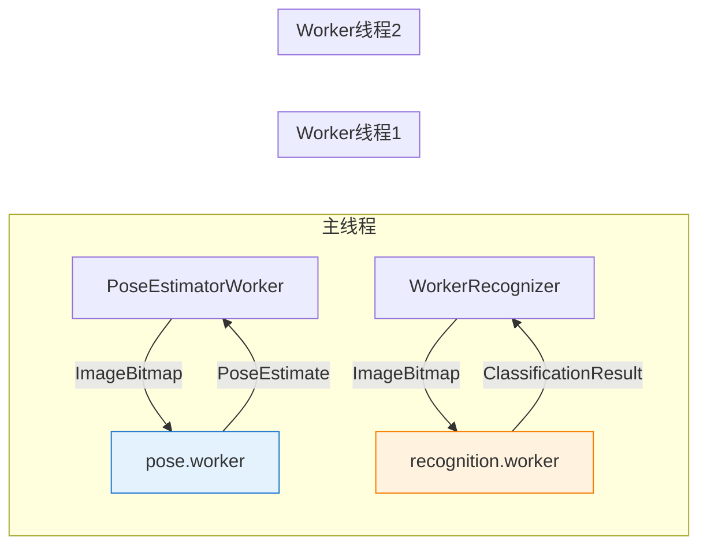
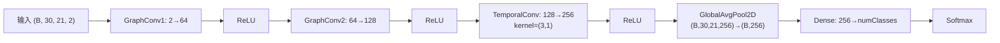
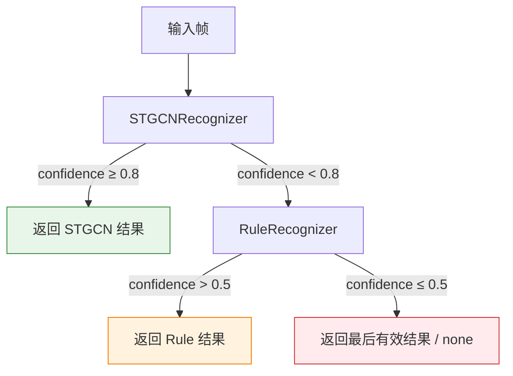
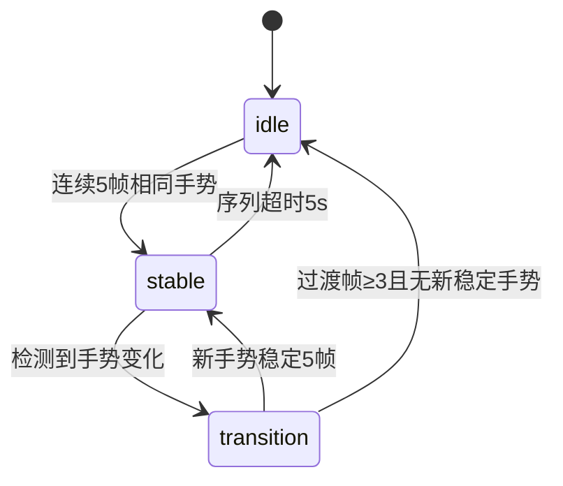
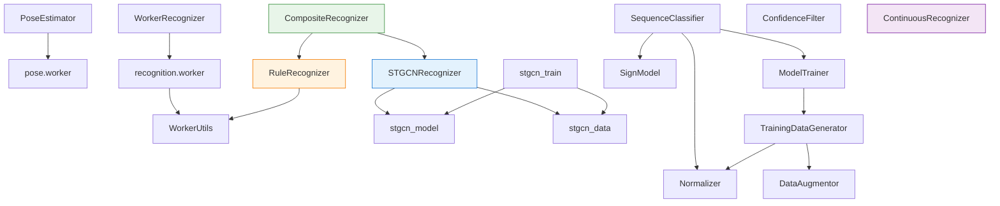

# 03 — 手势识别模块技术说明

## 1. 识别管线概览

SignBridge 的手势识别采用**多层级管线架构**，从摄像头原始帧到最终文字输出，经过姿态估计、关键点提取、多策略识别、置信度滤波和连续识别五个阶段。

### 1.1 完整数据流

```
摄像头帧 → MediaPipe Hands → pose.worker(关键点提取)
  → recognition.worker(识别) → CompositeRecognizer(STGCN优先 + Rule回退)
  → ConfidenceFilter(置信度滤波) → ContinuousRecognizer(连续识别) → 文字输出
```

### 1.2 管线流程图

```mermaid
flowchart TD
    A[摄像头 HTMLVideoElement] --> B[PoseEstimator / pose.worker]
    B -->|PoseEstimate| C[KeypointExtractor]
    C -->|KeypointSequence| D[CompositeRecognizer]
    D --> E[STGCNRecognizer]
    D --> F[RuleRecognizer]
    E -->|confidence ≥ 0.8| G[ConfidenceFilter]
    F -->|confidence ≥ 0.5| G
    G -->|accepted| H[ContinuousRecognizer]
    G -->|rejected| I[提示: 请重新打手语]
    H -->|GestureEvent[]| J[手势组合词典]
    J --> K[文字输出]

    style E fill:#e3f2fd,stroke:#1976d2
    style F fill:#fff3e0,stroke:#f57c00
    style G fill:#e8f5e9,stroke:#388e3c
    style H fill:#f3e5f5,stroke:#7b1fa2
```

### 1.3 设计目标

| 目标 | 实现方式 |
|------|---------|
| **实时性** | 双 Worker 架构，MediaPipe 推理与识别逻辑在独立线程运行，不阻塞主线程渲染 |
| **准确性** | CompositeRecognizer 组合 STGCN（深度学习）+ RuleRecognizer（几何规则），置信度优先级调度 |
| **连续性** | ContinuousRecognizer 状态机检测手势起止点，避免边界闪烁，支持手势组合词典 |
| **健壮性** | WorkerRecognizer 内置崩溃重启（最多 3 次）、心跳检测、超时降级到主线程识别 |

---

## 2. PoseEstimator — 姿态估计器

源文件：[PoseEstimator.ts](file:///d:/G/github/signbridge/frontend/src/modules/recognition/PoseEstimator.ts)

### 2.1 MediaPipe 双 Landmarker 架构

PoseEstimator 同时运行 **PoseLandmarker**（33 身体关键点）和 **HandLandmarker**（每手 21 关键点），两者并行初始化：

```typescript
const [pose, hand] = await Promise.all([
  PoseLandmarker.createFromOptions(vision, { numPoses: 1, runningMode: 'VIDEO' }),
  HandLandmarker.createFromOptions(vision, { numHands: 2, runningMode: 'VIDEO' }),
]);
```

### 2.2 WASM 模型加载

- WASM 文件集从 `appConfig.mediapipeWasmBaseUrl` 加载（支持自托管）
- Pose 模型：`pose_landmarker_full.task`（float16 量化）
- Hand 模型：`hand_landmarker.task`（float16 量化）
- 均从 Google Storage CDN 加载，可配置为本地路径

### 2.3 手部 Landmark 坐标系统

21 个关键点定义于 MediaPipe Hands 规范，坐标为归一化值 `[0, 1]`：

| 索引 | 关节点 | 索引 | 关节点 |
|------|--------|------|--------|
| 0 | 腕部 (WRIST) | 1-4 | 拇指 CMC→MCP→IP→TIP |
| 5-8 | 食指 MCP→PIP→DIP→TIP | 9-12 | 中指 MCP→PIP→DIP→TIP |
| 13-16 | 无名指 MCP→PIP→DIP→TIP | 17-20 | 小指 MCP→PIP→DIP→TIP |

### 2.4 低置信度回退机制

当关键点可见度不足时，使用上次有效值替代，保证管线连续性：

- 身体关键点：`visibility < 0.5` → 回退到 `lastValidBody`
- 手部整体：`confidence < 0.5` 或未检测到 → 回退到 `lastValidHand`，标记 `lowConfidence: true`

### 2.5 两种使用模式

| 模式 | 类 | 适用场景 |
|------|---|---------|
| 主线程同步 | `PoseEstimator` | 简单场景，直接在主线程推理 |
| Worker 异步 | `PoseEstimatorWorker` | 推荐模式，ImageBitmap 零拷贝传输，不阻塞 UI |

---

## 3. Worker 架构

### 3.1 双 Worker 设计

源文件：[pose.worker.ts](file:///d:/G/github/signbridge/frontend/src/modules/recognition/pose.worker.ts)、[recognition.worker.ts](file:///d:/G/github/signbridge/frontend/src/modules/recognition/recognition.worker.ts)



| Worker | 职责 | 输入 | 输出 |
|--------|------|------|------|
| `pose.worker.ts` | MediaPipe Pose+Hand 推理 | ImageBitmap | PoseEstimate（33+21+21 关键点） |
| `recognition.worker.ts` | 手势识别 | ImageBitmap | ClassificationResult（gloss_id, confidence） |

### 3.2 Worker 通信协议

**pose.worker** 消息格式：

```typescript
// 主线程 → Worker
type PoseWorkerRequest =
  | { type: 'init'; wasmUrl: string; poseModelUrl: string; handModelUrl: string }
  | { type: 'estimate'; bitmap: ImageBitmap; timestamp: number };

// Worker → 主线程
type PoseWorkerResponse =
  | { type: 'ready' }
  | { type: 'result'; estimate: PoseEstimate | null }
  | { type: 'error'; message: string };
```

**recognition.worker** 消息格式：

```typescript
// 主线程 → Worker
| { type: 'init' }
| { type: 'recognize'; bitmap: ImageBitmap; timestamp: number }
| { type: 'ping' }  // 心跳

// Worker → 主线程
| { type: 'ready' }
| { type: 'result'; result: ClassificationResult }
| { type: 'pong' }  // 心跳响应
| { type: 'error'; message: string }
```

### 3.3 WorkerUtils — 共享工具

源文件：[WorkerUtils.ts](file:///d:/G/github/signbridge/frontend/src/modules/recognition/WorkerUtils.ts)

被 `recognition.worker.ts` 和 `RuleRecognizer.ts` 共用，提供：
- `extractFeatures()`：从 21 关键点提取 5 指状态 + 拇指食指距离 + 张开度
- `matchRuleWithScore()`：带置信度梯度的规则匹配（0.5~1.0）
- `loadGestureLibrary()`：从 `/gestures.json` + IndexedDB 加载手势库

### 3.4 WorkerRecognizer 健壮性设计

源文件：[WorkerRecognizer.ts](file:///d:/G/github/signbridge/frontend/src/modules/recognition/WorkerRecognizer.ts)

| 机制 | 参数 | 行为 |
|------|------|------|
| 崩溃自动重启 | `MAX_WORKER_RESTARTS = 3` | onerror 触发重启，超限永久降级 |
| 单帧识别超时 | `RECOGNIZE_TIMEOUT_MS = 800` | 超时后 fallback 兜底当前帧 + 异步重启 |
| 心跳检测 | 间隔 5s，超时 3s | Worker 卡死时自动重启 |
| 健康重置 | `RESTART_COUNT_RESET_MS = 30000` | 健康运行 30s 后重置重启计数 |
| 降级模式 | `RuleRecognizer` | Worker 不可用时回退到主线程规则识别 |

---

## 4. STGCNRecognizer — 时空图卷积网络

源文件：[STGCNRecognizer.ts](file:///d:/G/github/signbridge/frontend/src/modules/recognition/STGCNRecognizer.ts)

### 4.1 模型架构



### 4.2 输入输出格式

| 项目 | 值 |
|------|----|
| 输入形状 | `[batch, 30, 21, 2]` — 30 帧 × 21 关键点 × 2 坐标(x,y) |
| 输出形状 | `[batch, numClasses]` — softmax 概率分布 |
| 帧缓冲 | 滑动窗口保存最近 30 帧归一化关键点 |
| 推理频率 | 每 3 帧推理一次（`inferEvery = 3`），避免过载 |

### 4.3 关键点归一化

实现平移 + 缩放不变性：

```typescript
function normalizeLandmarks(landmarks) {
  const wrist = landmarks[0];  // 以腕部为原点
  const mcp = landmarks[9];    // 中指 MCP 为尺度参考
  const palmSize = Math.hypot(mcp.x - wrist.x, mcp.y - wrist.y);
  return landmarks.map(lm => [
    (lm.x - wrist.x) / palmSize,
    (lm.y - wrist.y) / palmSize,
  ]);
}
```

### 4.4 置信度阈值

`STGCN_CONFIDENCE_THRESHOLD = 0.8`：仅当模型输出置信度 ≥ 0.8 时才采纳结果，否则回退到 RuleRecognizer。

### 4.5 模型加载优先级

| 优先级 | 来源 | 路径 |
|--------|------|------|
| 1 | HTTP 预训练模型 | `/models/stgcn/model.json` + `weights.bin` |
| 2 | IndexedDB 在线训练缓存 | `indexeddb://stgcn-gesture-model` |
| 3 | 未训练模型兜底 | `buildSTGCNModel()` 构建（准确率低） |

标签映射优先从 `/models/stgcn/labelMap.json` 加载，失败回退到 `stgcn_data.ts` 内置 `GESTURE_LABELS`。

### 4.6 stgcn_model.ts — 图卷积层

源文件：[stgcn_model.ts](file:///d:/G/github/signbridge/frontend/src/modules/recognition/stgcn_model.ts)

核心为自定义 `GraphConvLayer`（继承 `tf.layers.Layer`），实现空间图卷积：

$$X' = D^{-\frac{1}{2}} (A+I) D^{-\frac{1}{2}} X W$$

- **邻接矩阵**：基于 21 关键点骨骼边（`HAND_EDGES`）构建 21×21 对称矩阵，添加自环后对称归一化
- **自定义层注册**：`registerGraphConvLayer()` 调用 `tf.serialization.registerClass()`，加载含 GraphConv 的模型前必须调用
- **计算优化**：全部使用 2D matMul 实现，避免 3D×2D matMul 的梯度形状不匹配和 `tf.einsum` 无梯度问题

### 4.7 stgcn_data.ts — 数据定义

源文件：[stgcn_data.ts](file:///d:/G/github/signbridge/frontend/src/modules/recognition/stgcn_data.ts)

| 常量 | 值 | 含义 |
|------|---|------|
| `NUM_KEYPOINTS` | 21 | 手部关键点数 |
| `NUM_FRAMES` | 30 | 时序帧数 |
| `COORD_DIM` | 2 | 坐标维度 (x,y) |
| `NUM_CLASSES` | 10 | 手势类别数 |

10 种手势：`fist`, `open_palm`, `point_up`, `thumb_up`, `thumb_down`, `victory`, `i_love_you`, `pinch`, `three`, `horn`

骨骼图 `HAND_EDGES` 定义 23 条无向边（5 指骨骼 + 3 掌间连接）。

---

## 5. RuleRecognizer — 几何规则识别器

源文件：[RuleRecognizer.ts](file:///d:/G/github/signbridge/frontend/src/modules/recognition/RuleRecognizer.ts)

### 5.1 规则语法

手势规则以 JSON 数据驱动，支持运行时热加载和用户自定义：

```json
{
  "fingers": ["ext", "fold", "fold", "fold", "fold"],
  "thumb_index_dist_max": 0.3
}
```

| 约束 | 含义 |
|------|------|
| `ext` | 伸直 |
| `fold` | 弯曲 |
| `!ext` | 非伸直（含弯曲和半弯） |
| `!fold` | 非弯曲 |
| `any` | 任意 |
| `thumb_index_dist_max/min` | 拇指食指距离阈值（归一化） |

### 5.2 几何判定算法

手指状态判定采用**纯几何方法**（不依赖坐标轴方向），通过"指尖→MCP 与 MCP→腕部 的夹角余弦"判断：

- **伸直**：`tip-wrist 距离 > mcp-wrist × 1.4` 且 `cosAngle < -0.3`（夹角 > 107.5°，指尖背离腕部）
- **弯曲**：`tip-mcp 距离 < mcp-wrist × 0.6` 或 `cosAngle > 0.3`（夹角 < 72.5°，指尖朝向腕部）
- **半弯**：介于两者之间

### 5.3 置信度梯度

`matchRuleWithScore()` 返回 0.5~1.0 的置信度：
- 基础分 0.5（命中即得）
- 每根精确约束（ext/fold）匹配 +0.08（最多 5 根 = +0.4）
- 距离约束满足 +0.1（最多 1 个）

### 5.4 优劣势

| 优势 | 劣势 |
|------|------|
| 零延迟、无需模型加载 | 覆盖率有限（仅支持可规则描述的手势） |
| 可解释性强（规则透明） | 无法处理动态手势（运动轨迹） |
| 支持用户自定义手势（IndexedDB） | 手势间易混淆（边界情况） |

---

## 6. CompositeRecognizer — 组合识别器

源文件：[CompositeRecognizer.ts](file:///d:/G/github/signbridge/frontend/src/modules/recognition/CompositeRecognizer.ts)

### 6.1 优先级策略



### 6.2 单次遍历优化

识别过程采用单次遍历：按优先级依次调用每个识别器，**记录最后一个有效结果**。若某识别器结果满足其置信度阈值且非 `none`/`unknown`，立即返回。避免了对同一输入重复调用 `recognize()` 的开销。

### 6.3 可配置阈值

每个识别器可设置独立的置信度阈值，未指定时默认 `0.5`：

```typescript
new CompositeRecognizer(
  [new STGCNRecognizer(), new RuleRecognizer()],
  [0.8, 0.5],  // STGCN 需 ≥0.8，Rule 需 >0.5
);
```

---

## 7. ConfidenceFilter — 置信度滤波

源文件：[ConfidenceFilter.ts](file:///d:/G/github/signbridge/frontend/src/modules/recognition/ConfidenceFilter.ts)

### 7.1 阈值过滤

通过阈值判断分类结果是否可信，默认阈值 `0.6`：

```typescript
filter(result: ClassificationResult): FilterResult {
  if (result.confidence < this.threshold) {
    return { accepted: false, message: '请重新打手语' };
  }
  return { accepted: true };
}
```

### 7.2 拒绝处理

当识别结果被拒绝时，返回 `accepted: false` 并附带提示消息 `"请重新打手语"`，引导用户重新输入。该机制与前端 UI 联动，提供实时反馈。

---

## 8. ContinuousRecognizer — 连续手语识别

源文件：[ContinuousRecognizer.ts](file:///d:/G/github/signbridge/frontend/src/modules/recognition/ContinuousRecognizer.ts)

### 8.1 状态机模型



| 参数 | 值 | 含义 |
|------|---|------|
| `STABLE_FRAMES` | 5 | 连续 N 帧相同手势才算稳定 |
| `TRANSITION_FRAMES` | 3 | 过渡帧数（无手势或变化中） |
| `MAX_SEQUENCE_LENGTH` | 20 | 序列最大长度 |
| `SEQUENCE_TIMEOUT_MS` | 5000 | 5 秒无新手势则清空序列 |

### 8.2 帧缓冲与稳定化

`recentGestures` 缓冲最近帧的手势 ID，通过 `every()` 检查连续 N 帧是否完全相同。仅当新手势与上一次稳定手势不同时才加入序列，**避免连续重复**。

### 8.3 手势组合词典

支持多个手势组合为中文词组：

```typescript
const DEFAULT_COMBINATIONS = [
  { sequence: ['csl_1', 'csl_0'], chinese: '10', emoji: '🔟' },
  { sequence: ['thumbs_up', 'victory'], chinese: '做得好', emoji: '👍✌️' },
  { sequence: ['point_up', 'open_palm'], chinese: '你好', emoji: '☝️🖐' },
  // ...可扩展
];
```

组合匹配采用**序列末尾逐元素比较**（避免 `JSON.stringify` 的额外分配），匹配成功返回组合词组，否则直接拼接各手势中文。

---

## 9. 训练流水线

### 9.1 整体流程

```mermaid
flowchart TD
    A[TrainingDataGenerator] -->|生成合成序列| B[DataAugmentor]
    B -->|增强后数据| C[Normalizer]
    C -->|归一化 [T,126]| D[SignModel / buildSTGCNModel]
    D -->|模型训练| E[评估]
    E --> F[保存到 IndexedDB / 文件系统]
    E --> G[导出 labelMap.json]

    style A fill:#e3f2fd,stroke:#1976d2
    style B fill:#fff3e0,stroke:#f57c00
    style D fill:#e8f5e9,stroke:#388e3c
```

### 9.2 TrainingDataGenerator — 训练数据生成

源文件：[TrainingDataGenerator.ts](file:///d:/G/github/signbridge/frontend/src/modules/recognition/TrainingDataGenerator.ts)

基于词汇参数合成关键点序列，每个词汇生成 20-50 个增强样本：

1. **手形生成**：根据 `handshape_start`/`handshape_end` 获取 21 关键点模板（支持 `fist_a`, `v_shape`, `index_point`, `thumb_up`, `c_shape`, `o_shape`, `open_5` 等手形）
2. **运动轨迹**：根据 `movement` 类型计算插值轨迹（`static`, `circular`, `upward_arc`, `zigzag` 等）
3. **手形插值**：从起始手形线性过渡到结束手形
4. **基础增强**：随机平移、缩放(0.9-1.1)、旋转(±0.15rad)、噪声、时间扭曲
5. **进阶增强**：通过 DataAugmentor 施加

### 9.3 DataAugmentor — 数据增强

源文件：[DataAugmentor.ts](file:///d:/G/github/signbridge/frontend/src/modules/recognition/DataAugmentor.ts)

| 增强策略 | 默认概率 | 说明 |
|---------|---------|------|
| 左右镜像 | 0.3 | 交换左右手关键点，翻转 x 坐标 |
| 帧丢失 | 0.1 | 随机将某些帧置零，模拟检测失败 |
| 关键点遮挡 | 0.05 | 随机遮挡 1-3 个关键点，模拟手指被遮挡 |
| Mixup | 0.15 | 两个样本按 λ(0.7-0.9) 混合 |
| 高斯噪声 | std=0.008 | 叠加高斯分布噪声，z 轴减半 |
| 时序抖动 | ±2 帧 | 随机偏移帧时间位置，模拟速度不均匀 |

高斯随机数采用 Box-Muller 变换生成。

### 9.4 Normalizer — 归一化

源文件：[Normalizer.ts](file:///d:/G/github/signbridge/frontend/src/modules/recognition/Normalizer.ts)

三步归一化流程：

1. **空间归一化**：以腕部(点0)为原点，以腕部到中指MCP(点9)距离为尺度 → 平移+缩放不变性
2. **时间归一化**：线性插值重采样到固定长度 T=30 → 变长序列标准化
3. **展平**：输出 `[T*126]` 一维数组，单手时另一手补 0

### 9.5 SignModel — LSTM 分类模型

源文件：[SignModel.ts](file:///d:/G/github/signbridge/frontend/src/modules/recognition/SignModel.ts)

LSTM 模型架构，输入 `[30, 126]`：

```
LSTM(128, returnSequences=true) → LSTM(64) → Dense(64, relu) → Dropout(0.3) → Dense(numClasses, softmax)
```

训练配置：Adam 优化器(lr=0.001)，categoricalCrossentropy 损失，50 轮，batch=32，验证集 20%。模型版本化存储于 `indexeddb://signbridge-sign-model-v2`。

### 9.6 stgcn_train.ts — STGCN 训练模块

源文件：[stgcn_train.ts](file:///d:/G/github/signbridge/frontend/src/modules/recognition/stgcn_train.ts)

```typescript
const result = await trainSTGCN({
  samplesPerGesture: 120,   // 每种手势样本数
  epochs: 50,               // 训练轮数
  batchSize: 32,
  learningRate: 0.001,
  saveToIndexedDB: true,    // 浏览器端保存
  saveHandler: ...,         // Node.js 文件系统保存
  onLabelMap: ...,          // 标签映射回调
  onLog: ...,               // 日志回调
});
```

训练流程：合成数据生成 → 构建 STGCN 模型 → `model.fit()` 训练 → 独立测试集评估 → 保存模型 + 标签映射。训练数据来自 `stgcn_data.ts` 的参数化模板 + 随机增强。

### 9.7 ModelTrainer — 训练流程管理

源文件：[ModelTrainer.ts](file:///d:/G/github/signbridge/frontend/src/modules/recognition/ModelTrainer.ts)

协调 `TrainingDataGenerator` + `SignModel`，执行完整的 `trainAndExport()` 流程：
1. `generator.generate()` → 生成训练数据
2. `model.build(numClasses)` → 构建 LSTM 模型
3. `model.train(x, y, 50)` → 训练 50 轮
4. `model.save(MODEL_STORAGE_PATH)` → 保存到 IndexedDB
5. `saveLabelMap(labels)` → 保存标签映射到 IndexedDB

### 9.8 模型导出格式

| 文件 | 格式 | 说明 |
|------|------|------|
| `model.json` | TF.js LayersModel JSON | 模型拓扑 + 权重清单 |
| `weights.bin` | 二进制 | 模型权重数据 |
| `labelMap.json` | JSON | `{ format, labels[], chinese{}, numClasses, generatedAt }` |

---

## 10. 辅助模块

### 10.1 Recognizer 统一接口

源文件：[Recognizer.ts](file:///d:/G/github/signbridge/frontend/src/modules/recognition/Recognizer.ts)

```typescript
interface Recognizer {
  init(): Promise<void>;                                    // 加载模型/WASM
  recognize(input: FrameInput): Promise<ClassificationResult | null>;  // 识别单帧
  isReady(): boolean;                                       // 是否已就绪
  dispose(): void;                                          // 释放资源
}

interface FrameInput {
  element: HTMLVideoElement | HTMLCanvasElement;
  timestamp?: number;
}
```

所有识别器（STGCNRecognizer、RuleRecognizer、CompositeRecognizer）均实现此接口。

### 10.2 SequenceClassifier — 序列分类器

源文件：[SequenceClassifier.ts](file:///d:/G/github/signbridge/frontend/src/modules/recognition/SequenceClassifier.ts)

封装从原始关键点序列到分类结果的完整流程：

```
KeypointSequence → Normalizer.normalize() → SignModel.predict() → argmax → 查词汇库 → ClassificationResult
```

初始化时自动加载已训练模型，若不存在则触发 `ModelTrainer.trainAndExport()` 自动训练。

### 10.3 KeypointExtractor — 关键点提取器

源文件：[KeypointExtractor.ts](file:///d:/G/github/signbridge/frontend/src/modules/recognition/KeypointExtractor.ts)

从实时关键点流中提取有效动作序列，基于**运动起止检测**：

| 参数 | 默认值 | 含义 |
|------|--------|------|
| `windowSize` | 30 | 提取窗口大小（帧数） |
| `slideStep` | 5 | 滑动步长 |
| `motionThreshold` | 0.01 | 运动检测阈值（坐标方差） |
| `staticFrameLimit` | 10 | 连续静止帧数阈值 |

运动检测通过计算最近 5 帧的位移方差：方差 > 阈值 → 运动开始；方差 < 阈值持续 10 帧 → 运动结束。

### 10.4 类型定义

源文件：[recognition.ts](file:///d:/G/github/signbridge/frontend/src/types/recognition.ts)

核心类型：

| 类型 | 用途 |
|------|------|
| `ClassificationResult` | 识别结果：`{ gloss_id, chinese, confidence, all_probabilities? }` |
| `FrameKeypoints` | 单帧关键点：`{ left_hand, right_hand, timestamp }`（每手 21×3=63 维） |
| `KeypointSequence` | 关键点序列：`{ frames: FrameKeypoints[], fps }` |
| `NormalizedSequence` | 归一化序列：`{ data: number[], length: T }`（展平为 `[T*126]`） |
| `RecognitionStatus` | 识别状态机：`idle | waiting | capturing | recognizing | result | uncertain` |
| `PracticeScore` | 跟练评分：手形分 + 位置分 + 运动分 + 对齐帧相似度 |

---

## 附录：模块依赖关系


