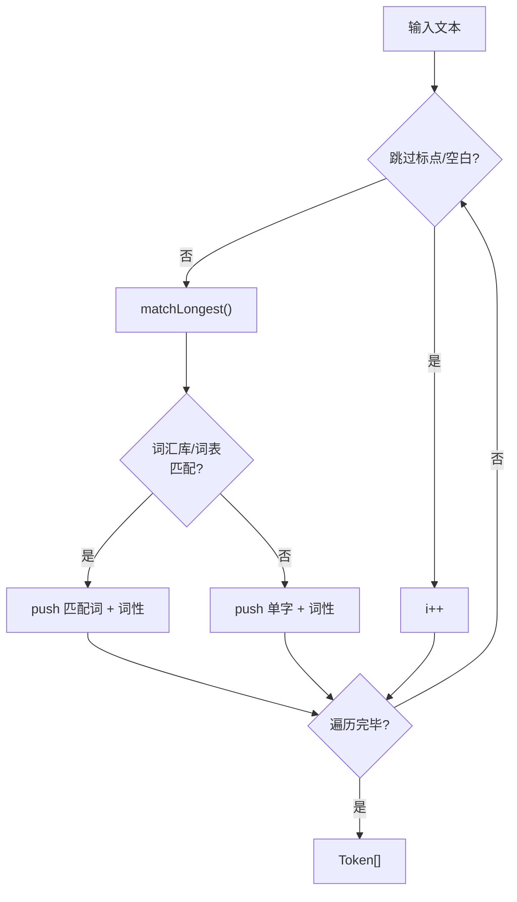
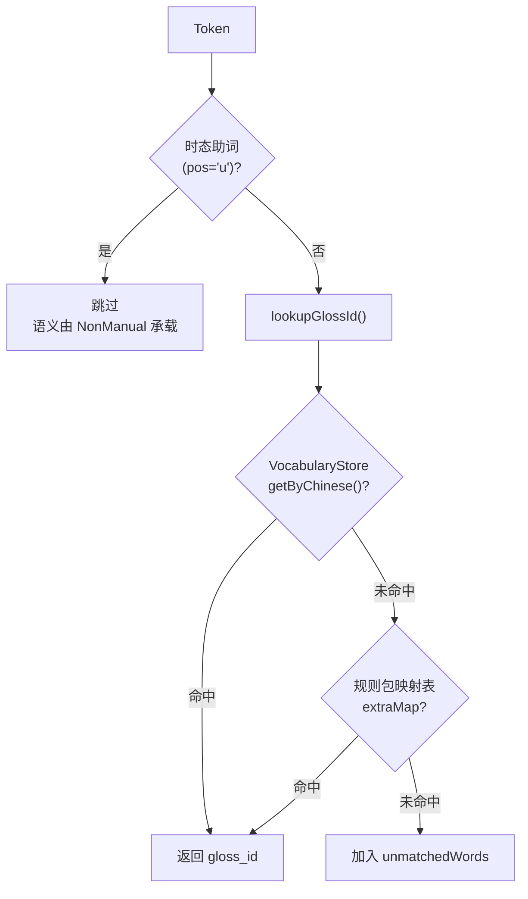

# 4. 语法引擎

## 1. 语法引擎概览

语法引擎是 SignBridge 的核心智能模块，负责将中文自然语言文本转换为中国手语（CSL）词汇序列。它不是简单的逐字翻译，而是经过分词、语序调整、词汇映射、非手动标记四个阶段，实现从「中文语序」到「手语语序」的完整转换。

### 设计目标

- **语序正确**：按中国手语语法调整主宾谓、否定后置、疑问后置等
- **词汇对齐**：中文词必须映射到词汇库中有动作数据的 `gloss_id`
- **非手动信号**：自动为疑问、否定、强调等句型附加面部表情和头势
- **可扩展**：规则包机制支持切换不同手语体系（如国际手语 IS）

### 四阶段管线

```mermaid
flowchart LR
    A["中文文本<br/>「我不去医院」"] --> B["Tokenizer<br/>分词器"]
    B -->|Token[]| C["Rewriter<br/>语序重写器"]
    C -->|Token[]| D["GlossMapper<br/>词汇映射器"]
    D -->|GlossSequenceItem[]| E["NonManualMarker<br/>非手动标记检测"]
    E --> F["GlossSequence<br/>手语词汇序列"]

    style A fill:#1e293b,stroke:#3b82f6,color:#e2e8f0
    style F fill:#1e293b,stroke:#22c55e,color:#e2e8f0
```

核心入口为 [GrammarEngine.ts](file:///d:/G/github/signbridge/frontend/src/modules/grammar/GrammarEngine.ts) 的 `convert()` 方法，依次串联四个阶段：

```typescript
// GrammarEngine.convert() 核心流程
const tokens = await this.tokenizer.tokenize(text);           // 1. 分词
const rewrittenTokens = this.rewriter.rewrite(tokens);        // 2. 重写
const { items, unmatchedWords } = await this.glossMapper.map(rewrittenTokens); // 3. 映射
const sentenceNonManual = this.nonManualMarker.mark(rewrittenTokens, items);   // 4. 标记
```

## 2. Tokenizer — 分词器

### 算法：正向最大匹配（FMM）

[Tokenizer.ts](file:///d:/G/github/signbridge/frontend/src/modules/grammar/Tokenizer.ts) 采用**正向最大匹配**（Forward Maximum Match）算法进行中文分词。该算法从文本左侧开始，在每一步尝试匹配最长的词，保证了手语词汇库中的复合词（如「你好」「为什么」）不被错误地拆分为单字。

### 分词词典构建

分词词典由两部分构成：

| 来源 | 说明 |
|------|------|
| 词汇库（VocabularyStore） | 所有 `chinese` 字段，按长度降序排列 |
| 预定义词表 | 代词、动词、量词、介词、否定词、疑问词、强调词、名词 |

启动时 `ensureLoaded()` 从 `VocabularyStore` 加载全部中文词，构建 `wordToCategory` 映射和 `vocabWords` 数组（按长度降序），并计算 `maxWordLen` 作为 FMM 匹配窗口上限。

### 分词流程



`matchLongest()` 从最长窗口向下逐字缩短尝试，优先查 `wordToCategory`（词汇库），再查预定义词表。未命中则返回 `null`，外层按单字切分。

### 词性标注

[PosTagger](file:///d:/G/github/signbridge/frontend/src/modules/grammar/Tokenizer.ts) 为每个词标注词性，标注优先级：

1. 预定义词表（代词 `r`、动词 `v`、助词 `u`、否定 `neg`、疑问 `qst`、强调 `emph` 等）
2. 词汇库 `category` 字段推断（含「动」→ `v`，含「名」→ `n`，等）
3. 默认标记为 `x`（其他）

> 注意：助词优先于动词——「了/着/过」作时态助词时标注为 `u` 而非 `v`。

## 3. Rewriter — 语序重写器

[Rewriter.ts](file:///d:/G/github/signbridge/frontend/src/modules/grammar/Rewriter.ts) 负责将中文语序重写为中国手语语序。它维护一组 `GrammarRule`，按优先级从高到低依次应用。

### 核心规则

| 规则 | 优先级 | 示例 |
|------|--------|------|
| 宾语前移 `object_fronting` | 100 | 「去医院」→「医院去」 |
| 否定词后置 `negation_rear` | 90 | 「我不去」→「我去 不」 |
| 疑问词后置 `question_rear` | 80 | 「你去哪里」→「你去 哪里」 |
| 去除功能词 `function_word_removal` | 50 | 去除量词、语气词、介词 |

### 宾语前移

仅对**方向/目标动词**（去、到、回、上、下、进、出、过）生效。检测「方向动词 + 名词」模式，将名词前移：

```
原始：[去/v, 医院/n] → 重写：[医院/n, 去/v]
```

### 否定词后置

收集句子中的否定词，延迟到第一个动词后插入。若无动词，追加到句末：

```
原始：[我/r, 不/neg, 去/v] → 重写：[我/r, 去/v, 不/neg]
```

### 疑问词后置

将所有疑问词移到句末，符合中国手语疑问句语序：

```
原始：[你/r, 去/v, 哪里/qst] → 重写：[你/r, 去/v, 哪里/qst]
```

### 规则应用策略

规则按 `priority` 降序执行，高优先级规则先处理结构变化（宾语前移），低优先级最后清理（去除功能词）。每条规则的 `action.type` 决定处理方式：

- `reorder`：重排序（调用对应的 `objectFronting` / `negationRear` / `questionRear`）
- `remove`：按词性过滤移除
- `add_non_manual`：由 NonManualMarker 处理，此处透传

可通过 `RewriterConfig` 独立开关每条规则：

```typescript
interface RewriterConfig {
  enableObjectFronting: boolean;    // 宾语前移
  enableFunctionWordRemoval: boolean; // 去除功能词
  enableQuestionRear: boolean;      // 疑问词后置
  enableNegationRear: boolean;      // 否定词后置
}
```

## 4. GlossMapper — 词汇映射器

[GlossMapper.ts](file:///d:/G/github/signbridge/frontend/src/modules/grammar/GlossMapper.ts) 将重写后的 Token 序列映射为 `GlossSequenceItem[]`，每个项包含 `gloss_id` 和 `chinese`。

### 查询策略



**两级查询**：优先从 `VocabularyStore.getByChinese()` 查询词汇库，其次从规则包的 `extraMap`（`GlossMapping[]`）查询。均未命中则收集到 `unmatchedWords`，在最终结果中透传。

### 时态助词处理

词性为 `u`（了/着/过）的 Token 不映射到任何 `gloss_id`——它们的语义由 `NonManualMarker` 承载（「了」→ completion，「着」→ continuous，「过」→ experience）。

## 5. NonManualMarker — 非手动标记检测

[NonManualMarker.ts](file:///d:/G/github/signbridge/frontend/src/modules/grammar/NonManualMarker.ts) 根据句子中的语义特征词检测句子类型，并返回对应的非手动标记（面部表情 + 头势）。

### 句子类型检测

检测优先级从高到低：

| 优先级 | 类型 | 触发条件 | 表情 | 头势 |
|--------|------|----------|------|------|
| 1 | `question` | 含疑问词/「吗」 | `QUESTION`（挑眉） | `SLIGHT_NOD`（头部前倾） |
| 2 | `negation` | 含否定词 | `NEGATIVE`（皱眉） | `SHAKE`（摇头） |
| 3 | `emphasis` | 含强调词 | `EMPHASIS`（瞪眼） | `NONE` |
| 4 | `completion` | 句末「了」 | `NEUTRAL` | `SLIGHT_NOD` |
| 5 | `continuous` | 句末「着」 | `NEUTRAL` | `NONE` |
| 6 | `experience` | 句末「过」 | `NEUTRAL` | `SHAKE` |
| 7 | `statement` | 默认 | — | — |

### 标记映射

非手动标记以 `NonManualMark` 对象返回，包含 `expression`（`FacialExpression` 枚举）和 `head_movement`（`HeadMovement` 枚举）。陈述句返回 `undefined`，不附加任何标记。

### 与 ClipBuilder 的集成

`GlossSequence.sentence_non_manual` 会被 `ClipBuilder` 读取，在生成动画片段时叠加到整个句子的播放过程中——虚拟人在执行手语动作的同时，持续展现对应的表情和头势。

## 6. 规则包扩展

### zhCSL 规则包结构

[zhCSL.ts](file:///d:/G/github/signbridge/frontend/src/modules/grammar/rules/zhCSL.ts) 定义了中国手语规则包 `zhCSLRulePack`，结构如下：

```typescript
interface GrammarRulePack {
  id: string;                    // 'zhCSL'
  name: string;                  // '中国手语'
  source_lang: string;           // 'zh'
  target_lang: string;           // 'csl'
  rules: GrammarRule[];          // 重写规则集
  mappings: GlossMapping[];      // 词汇补充映射
  non_manual_rules: NonManualRule[]; // 非手动规则
}
```

- **rules**：4 条重写规则（宾语前移、否定后置、疑问后置、去除功能词）
- **mappings**：30+ 条补充映射（代词、常用动词、疑问词、否定词），覆盖词汇库未收录的常用词
- **non_manual_rules**：4 条非手动规则（question / negation / emphasis / conditional）

### 规则包注册中心

[rules/index.ts](file:///d:/G/github/signbridge/frontend/src/modules/grammar/rules/index.ts) 提供 `registerCustomRulePack()` 接口，用于扩展支持其他手语体系。

### 新增自定义规则包步骤

1. 在 `rules/` 目录下创建新文件（如 `is.ts`），定义 `GrammarRulePack` 对象
2. 在 `rules/index.ts` 中调用 `registerRulePack()` 注册
3. 通过 `grammarEngine.setRulePack(pack)` 切换到新规则包

规则包中的 `mappings` 会更新到 `GlossMapper.extraMap`，`non_manual_rules` 会更新到 `NonManualMarker.rules`，实现动态切换。
