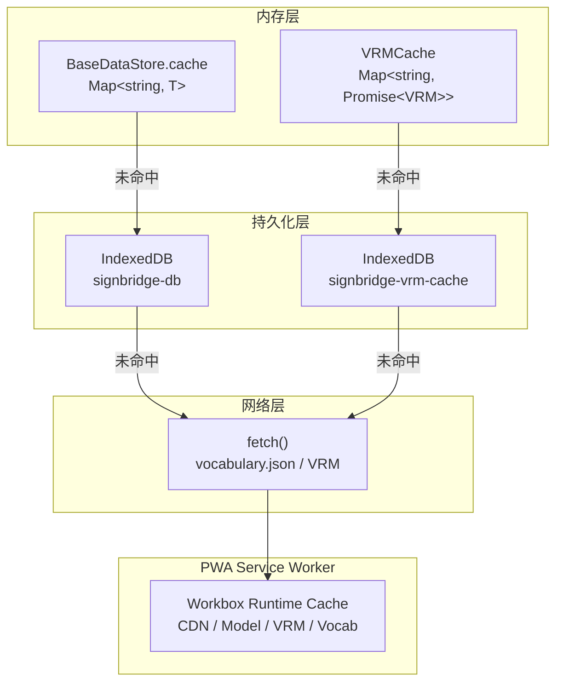
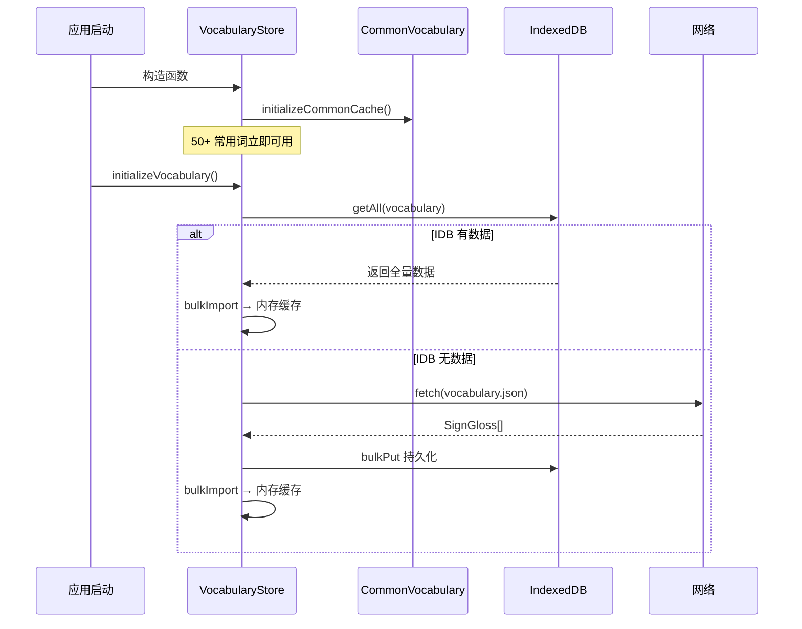
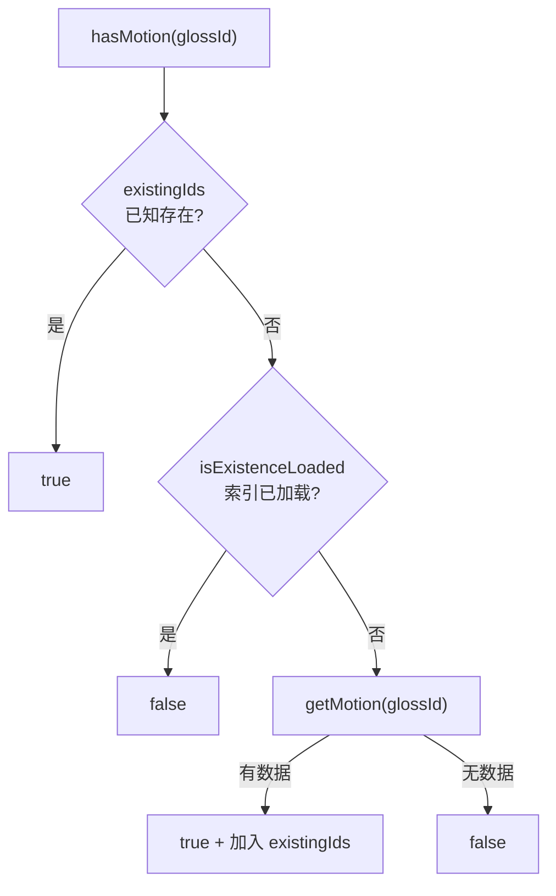
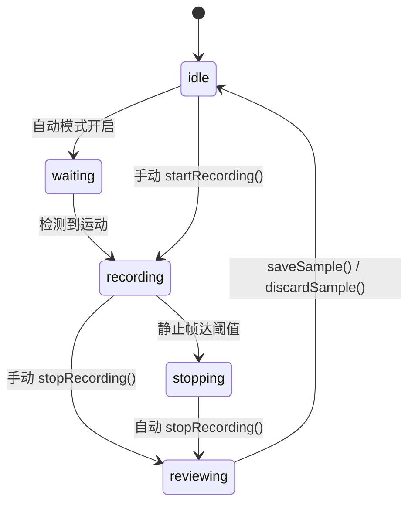
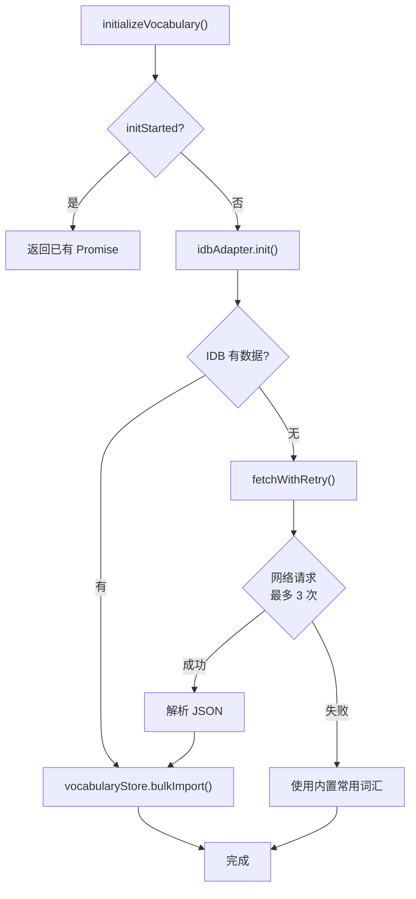
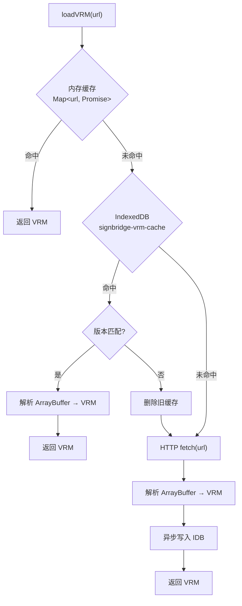

# 5. 数据层

## 1. 数据层概览

SignBridge 采用**纯前端存储架构**，不依赖任何后端服务。核心设计原则：

| 原则 | 说明 |
|------|------|
| 离线优先 | 优先使用本地缓存，网络仅用于数据同步 |
| 隐私保护 | 所有用户数据存储在本地浏览器，不上传服务器 |
| 零后端依赖 | 全部数据通过静态文件 + IndexedDB 管理 |

### 存储架构



## 2. IndexedDBAdapter — IndexedDB 封装

[IndexedDBAdapter.ts](file:///d:/G/github/signbridge/frontend/src/modules/data/IndexedDBAdapter.ts) 将回调式 IndexedDB API Promise 化，提供统一的异步 CRUD 接口。

### 数据库结构

- **数据库名称**：`signbridge-db`
- **数据库版本**：2
- **Object Stores**：

| Store | keyPath | 索引 | 用途 |
|-------|---------|------|------|
| `vocabulary` | `gloss_id` | `chinese`, `category` | 手语词汇库 |
| `motion_data` | `gloss_id` | — | 动作关键帧数据 |
| `cache` | `key` | — | 通用键值缓存 |
| `collected_samples` | `id` | `gloss_id`, `chinese`, `collectedAt` | 用户采集样本 |

### 版本升级

`onupgradeneeded` 事件中根据 `STORE_CONFIGS` 创建 Object Store 和索引。已存在的 Store 跳过创建，仅新增。

### 事务处理

所有写操作通过 `runTransaction()` 统一封装，在事务 `oncomplete` 时 resolve、`onerror` 时 reject：

```typescript
// 单事务批量写入，提升性能
async bulkPut<T>(store: string, values: T[]): Promise<void>
```

### 核心接口

| 方法 | 说明 |
|------|------|
| `init()` | 初始化数据库连接 |
| `put(store, value)` | 写入单条（已存在则覆盖） |
| `get(store, key)` | 按主键读取 |
| `getAll(store)` | 读取全部 |
| `getByIndex(store, index, value)` | 按索引查询 |
| `bulkPut(store, values)` | 批量写入（单事务） |
| `delete(store, key)` | 按主键删除 |
| `clear(store)` | 清空 Store |

全局单例：`idbAdapter`。

## 3. VocabularyStore — 词汇库

[VocabularyStore.ts](file:///d:/G/github/signbridge/frontend/src/modules/data/VocabularyStore.ts) 管理手语词汇数据，继承 [BaseDataStore](file:///d:/G/github/signbridge/frontend/src/modules/data/BaseDataStore.ts)，提供内存缓存 + IndexedDB 双层存储。

### 加载策略：内置优先 + 后台加载



1. **构造函数**：将 `COMMON_VOCABULARY`（50+ 常用词）写入内存缓存，零等待即可查询
2. **后台加载**：`initializeVocabulary()` 从 IDB 读取完整数据；若 IDB 为空则从 `vocabulary.json` 网络获取
3. **全量缓存**：`bulkImport()` 后标记 `isFullCacheLoaded = true`，后续查询直接走内存

### 数据格式

每个 `SignGloss` 包含 `gloss_id`、`chinese`、`english`、`category`、`difficulty`、`manual`（手形/位置/运动/朝向）、`non_manual`（表情/头势）、`duration_ms` 等字段。

### 查询接口

| 方法 | 说明 | 缓存策略 |
|------|------|----------|
| `getByChinese(word)` | 按中文精确查询 | 先缓存后 IDB |
| `getByCategory(cat)` | 按分类查询 | 确保全量缓存后内存过滤 |
| `search(query)` | 模糊搜索 | 全量缓存后 `includes` 匹配 |
| `getAll()` | 获取全部词汇 | 确保全量缓存后返回 |
| `getCategories()` | 获取所有分类 | 全量缓存后遍历去重 |

## 4. MotionDataStore — 动作数据存储

[MotionDataStore.ts](file:///d:/G/github/signbridge/frontend/src/modules/data/MotionDataStore.ts) 管理手语动作关键帧数据，同样继承 `BaseDataStore`。

### 存储格式

每条 `MotionData` 以 `gloss_id` 为主键，包含该手语动作的关键帧序列、帧率、时长等信息。

### 存在性索引

`MotionDataStore` 维护 `existingIds: Set<string>` 快速判断某 `gloss_id` 是否有动作数据：



`preloadExistence()` 一次性读取所有 `gloss_id`，后续 `hasMotion()` 直接返回，无需逐个查询 IDB。

### 与 ClipBuilder 的数据交互

`ClipBuilder` 构建 Clip 时，先通过 `hasMotion()` 检查是否有预定义动作数据，有则直接使用；无则根据 `SignGloss.manual` 字段参数化生成。

## 5. DataCollector — 数据采集

[DataCollector.ts](file:///d:/G/github/signbridge/frontend/src/modules/data/DataCollector.ts) 采集用户跟练时的手部关键点数据，用于模型训练和评分。

### 采集流程



### 两种录制模式

- **手动模式**：调用 `startRecording()` / `stopRecording()` 控制
- **自动模式**：基于手腕位移方差检测运动起止，自动管理录制状态

### 数据脱敏

采集的 `CollectedSample` 不包含用户身份信息，仅存储：
- `gloss_id` + `chinese`：标注信息
- `normalizedData`：归一化后的 `[T, 126]` 特征数据
- `dominantHand`：左右手标记
- `quality`：质量评分（0-1）

`collector` 字段为可选，由用户主动填写。

### 质量评估

`assessQuality()` 从三个维度评分：
1. **帧数合理性**：与目标帧数 30 的比值，过少或过多扣分
2. **关键点完整性**：有手部数据的帧占比，低于 80% 扣分
3. **运动幅度**：手腕平均位移，过低扣分

## 6. DataInitializer — 数据初始化

[DataInitializer.ts](file:///d:/G/github/signbridge/frontend/src/modules/data/DataInitializer.ts) 负责应用启动时的数据加载，确保词汇数据就绪。

### 启动流程



### 防竞态：getVocabularyReadyPromise()

`GrammarEngine.convert()` 在执行前调用 `getVocabularyReadyPromise()` 等待数据初始化完成，避免在数据未就绪时全部词汇不匹配的问题。该函数返回 `initPromise`——若初始化尚未启动则返回已 resolve 的 Promise。

### 网络重试

`fetchWithRetry()` 对 5xx 错误和网络异常按指数退避重试（最多 3 次，基础延迟 500ms），4xx 错误不重试。

## 7. VRMCache — VRM 模型缓存

[VRMCache.ts](file:///d:/G/github/signbridge/frontend/src/modules/avatar/VRMCache.ts) 实现 VRM 模型文件的三级缓存加载。它使用独立的 IndexedDB 数据库（`signbridge-vrm-cache`），不复用 `IndexedDBAdapter`，避免修改全局 Store 配置。

### 三级缓存策略



### 缓存命中细节

1. **内存缓存**：`Map<string, Promise<VRM>>`，同一 URL 返回同一 Promise，避免 React StrictMode 双重渲染重复加载
2. **IndexedDB**：存储 `{ key, arrayBuffer, timestamp, version }`，`version` 不匹配时作废旧缓存
3. **HTTP**：使用 `GLTFLoader` + `VRMLoaderPlugin` 解析二进制数据

### 失败处理

- IDB 读取/解析失败 → 回退到 HTTP，异步清理损坏缓存
- HTTP 加载失败 → 清除内存缓存中的 Promise，允许后续重试
- 所有 IDB 操作均 try-catch，不阻塞加载流程

### 缓存管理

| 方法 | 说明 |
|------|------|
| `loadVRM(url)` | 统一加载入口（三级缓存） |
| `clearVRMCache(url?)` | 清除内存缓存 |
| `clearVRMCachePersistent(url?)` | 清除 IDB 持久化缓存 |

## 8. validateVocabulary — 词汇校验

[validateVocabulary.ts](file:///d:/G/github/signbridge/frontend/src/modules/data/validateVocabulary.ts) 在开发环境启动时校验内置词汇数据的合法性。

### 校验规则

对每个 `SignGloss` 的以下字段检查是否在对应枚举的合法值集合中：

| 字段 | 枚举 |
|------|------|
| `manual.handshape_start` / `handshape_end` | `HandShape`（17 个值） |
| `manual.location_start` / `location_end` | `HandLocation`（13 个值） |
| `manual.movement` | `Movement`（20 个值） |
| `manual.palm_orientation` | `PalmOrientation`（6 个值） |
| `non_manual.expression` | `FacialExpression`（9 个值） |
| `non_manual.head_movement` | `HeadMovement`（8 个值） |

### 运行时机

`runVocabularyValidationOnStartup()` 仅在 `import.meta.env.DEV` 为 true 时执行，发现非法字段通过 `logger.warn` 输出报告，**不阻塞启动**。

## 9. PWA 缓存策略

[vite.config.ts](file:///d:/G/github/signbridge/frontend/vite.config.ts) 中通过 `vite-plugin-pwa` 配置 Workbox Service Worker，提供离线访问能力。

### 预缓存（globPatterns）

仅预缓存核心静态资源，大文件由 runtimeCaching 按需拉取：

```
globPatterns: ['**/*.{js,css,html,ico,woff2}']
globIgnores:  ['**/data/vocabulary.json', '**/models/*.vrm', '**/pwa-*.png']
```

- **单文件上限**：`maximumFileSizeToCacheInBytes = 2MB`，避免大文件拖慢首次访问

### 运行时缓存（runtimeCaching）

| URL 模式 | 策略 | 缓存名 | 过期时间 | 最大条目 |
|----------|------|--------|----------|----------|
| `cdn.jsdelivr.net` | **CacheFirst** | `cdn-cache` | 30 天 | 50 |
| `storage.googleapis.com` | **StaleWhileRevalidate** | `model-cache` | 7 天 | 10 |
| `*.vrm` | **CacheFirst** | `vrm-model-cache` | 30 天 | 5 |
| `vocabulary.json` | **NetworkFirst** | `vocabulary-cache` | 7 天 | 1 |

### 策略说明

- **CacheFirst**：优先使用缓存，离线场景友好，适合不常变更的 CDN 资源和 VRM 模型
- **StaleWhileRevalidate**：先返回缓存，后台更新，适合 TensorFlow 模型文件
- **NetworkFirst**：优先网络获取保证数据新鲜度，网络失败降级到缓存，适合词汇数据

### 开发环境

PWA 在开发环境不启用（`devOptions.enabled: false`），避免 Service Worker 与 Vite HMR 冲突。
