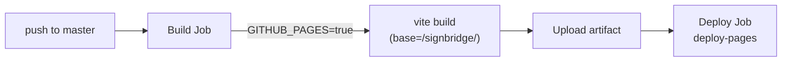
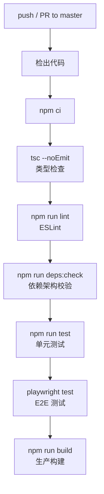

# 6. 开发指南

## 1. 环境搭建

### 前置条件

| 工具 | 版本要求 | 说明 |
|------|----------|------|
| Node.js | 24+ | CI 使用 Node 24，本地需匹配 |
| npm | 随 Node.js 安装 | 包管理器 |
| Git | — | 版本控制 |

### 安装步骤

```bash
git clone https://github.com/your-org/signbridge.git
cd signbridge/frontend
npm install
```

### 环境变量配置

复制 [.env.example](file:///d:/G/github/signbridge/frontend/.env.example) 为 `.env`，按需修改：

```bash
# 应用显示名称
VITE_APP_NAME=手语桥 SignBridge

# MediaPipe tasks-vision wasm 基址
VITE_MEDIAPIPE_WASM_BASE_URL=https://cdn.jsdelivr.net/npm/@mediapipe/tasks-vision@0.10.35/wasm

# MediaPipe Hands 旧版 wasm CDN 基址
VITE_MEDIAPIPE_HANDS_CDN_BASE=https://cdn.jsdelivr.net/npm/@mediapipe/hands

# 预训练手势识别模型 URL
VITE_GESTURE_MODEL_URL=https://storage.googleapis.com/mediapipe-models/gesture_recognizer/gesture_recognizer/float16/1/gesture_recognizer.task

# 默认手势库 JSON 路径
VITE_GESTURE_LIBRARY_URL=/gestures.json

# 词汇库 JSON 路径
VITE_VOCABULARY_URL=/data/vocabulary.json
```

### 启动开发服务器

```bash
npm run dev
```

默认端口 **5173**，浏览器访问 `http://localhost:5173`。

## 2. 开发命令

| 命令 | 说明 |
|------|------|
| `npm run dev` | 启动 Vite 开发服务器（端口 5173，HMR 热更新） |
| `npm run build` | 生产构建（`tsc -b` 类型检查 + `vite build`） |
| `npm run lint` | ESLint 代码规范检查 |
| `npm run test` | Vitest 单元测试（单次运行） |
| `npm run test:watch` | Vitest 监听模式 |
| `npm run test:coverage` | Vitest 覆盖率报告（v8 引擎） |
| `npm run deps:check` | dependency-cruiser 依赖架构校验 |
| `npm run graph` | 生成依赖关系图（SVG） |
| `npm run graph:archi` | 生成架构图（SVG） |
| `npm run e2e` | Playwright E2E 测试 |
| `npm run e2e:ui` | Playwright E2E 测试（UI 模式） |

## 3. 项目结构

```
frontend/src/
├── kernel/                    # 微内核
│   ├── EventBus.ts            # 事件总线：插件间通信
│   ├── PluginManager.ts       # 插件注册/激活/卸载
│   └── types.ts               # Plugin / PluginManifest 类型
│
├── plugins/                   # 插件注册中心
│   └── index.ts               # 4 个内置插件定义 + registerPlugins()
│
├── modules/                   # 业务模块（纯逻辑，无 UI）
│   ├── avatar/                # 虚拟人驱动
│   │   ├── ClipBuilder.ts     # 手语动画片段构建
│   │   ├── MotionPlayer.ts    # 动作播放引擎
│   │   ├── VRMCache.ts        # VRM 模型三级缓存
│   │   ├── VRMAdapter.ts      # VRM 骨骼适配
│   │   ├── IKSolver.ts        # 逆运动学求解
│   │   ├── KalidokitSolver.ts # MediaPipe → VRM 姿态映射
│   │   ├── HandShape.ts       # 手形→手指关节角度
│   │   └── skeleton/          # 2D/3D 骨骼定义
│   ├── recognition/           # 手语识别
│   │   ├── Recognizer.ts      # 手势识别器
│   │   ├── PoseEstimator.ts   # 姿态估计
│   │   ├── Normalizer.ts      # 关键点归一化
│   │   ├── STGCNRecognizer.ts # ST-GCN 深度学习识别器
│   │   └── *.worker.ts        # Web Worker 异步推理
│   ├── grammar/               # 语法引擎
│   │   ├── GrammarEngine.ts   # 四阶段管线入口
│   │   ├── Tokenizer.ts       # FMM 分词器
│   │   ├── Rewriter.ts        # 语序重写器
│   │   ├── GlossMapper.ts     # 词汇映射器
│   │   ├── NonManualMarker.ts # 非手动标记检测
│   │   └── rules/             # 规则包（zhCSL 等）
│   ├── data/                  # 数据层
│   │   ├── IndexedDBAdapter.ts # IndexedDB 封装
│   │   ├── BaseDataStore.ts   # 缓存管理基类
│   │   ├── VocabularyStore.ts # 词汇库
│   │   ├── MotionDataStore.ts # 动作数据
│   │   ├── DataCollector.ts   # 数据采集
│   │   ├── DataInitializer.ts # 数据初始化
│   │   ├── CommonVocabulary.ts # 内置常用词汇
│   │   └── validateVocabulary.ts # 词汇校验
│   ├── learning/              # 学习评分
│   │   ├── DTW.ts             # 动态时间规整算法
│   │   └── Scoring.ts         # 跟练评分
│   └── debug/                 # 调试工具
│       ├── logger.ts          # 分级日志 + ring buffer
│       └── StartupTracker.ts  # 启动阶段性能追踪
│
├── components/                # UI 组件
│   ├── avatar/                # 虚拟人组件（3D 画布、骨骼、表情覆盖层）
│   ├── common/                # 通用组件（ErrorBoundary、PageHeader）
│   ├── debug/                 # 调试组件（PerformancePanel）
│   ├── layout/                # 布局组件（Header、Sidebar、Layout）
│   ├── learning/              # 学习组件（PracticeMode、ScoreFeedback）
│   ├── sign/                  # 手语组件（SignCamera、HandTracker）
│   └── voice/                 # 语音组件（VoiceInput）
│
├── pages/                     # 页面组件
│   ├── VoiceToSignPage.tsx    # 语音转手语
│   ├── SignToTextPage.tsx     # 手语识别
│   ├── DialoguePage.tsx       # 双向对话
│   └── LearningPage.tsx       # 手语学习
│
├── hooks/                     # React Hooks
│   ├── useAvatarPlayer.ts     # 虚拟人播放控制
│   ├── useHandTracking.ts     # 手部追踪
│   ├── usePoseTracking.ts     # 姿态追踪
│   └── usePerformanceMonitor.ts # 性能监控
│
├── stores/                    # Zustand 状态管理
│   ├── appStore.ts            # 全局应用状态
│   └── avatarStore.ts         # 虚拟人状态
│
├── types/                     # TypeScript 类型定义
│   ├── sign.ts                # SignGloss / HandShape / Movement 枚举
│   ├── grammar.ts             # Token / GrammarRule / GlossSequence 类型
│   ├── avatar.ts              # MotionData / Clip 类型
│   └── recognition.ts         # 关键点 / 识别结果类型
│
├── styles/                    # 全局样式
│   └── global.css             # Tailwind CSS 入口
│
├── data/                      # 静态数据
│   └── demoScenarios.ts       # 演示场景数据
│
├── App.tsx                    # 应用根组件
├── routes.tsx                 # 路由配置（从插件读取）
├── config.ts                  # 应用配置（环境变量聚合）
└── main.tsx                   # 入口文件
```

## 4. 扩展插件

SignBridge 采用**微内核 + 插件化架构**。每个功能页面是一个插件，路由和菜单由插件声明，而非静态硬编码。

### 新增功能页面的完整步骤

以新增「手语词典」页面为例：

#### 1. 创建页面组件

在 `pages/` 目录下创建 `DictionaryPage.tsx`：

```typescript
export function DictionaryPage() {
  return <div>手语词典</div>;
}
```

#### 2. 在 plugins/index.ts 定义 Plugin 对象

```typescript
const dictionaryPlugin: Plugin = {
  manifest: {
    name: 'dictionary',
    version: '1.0.0',
    displayName: '手语词典',
    routes: [
      {
        path: 'dictionary',
        component: lazyPage(() => import('@/pages/DictionaryPage'), 'DictionaryPage'),
        label: '手语词典',
        icon: '📖',
      },
    ],
    menuItems: [
      { id: 'dictionary', label: '手语词典', icon: '📖', route: '/dictionary', order: 50 },
    ],
    activeByDefault: true,
  },
  async install() {},
  async activate() {},
};
```

#### 3. 注册到 BUILTIN_PLUGINS 数组

```typescript
const BUILTIN_PLUGINS = [
  // ... 已有插件
  { name: 'dictionary', factory: () => dictionaryPlugin },
];
```

**无需修改 `routes.tsx` 和 `Sidebar.tsx`**——路由和菜单从 `PluginManager` 动态读取。

### 插件 manifest 字段说明

| 字段 | 类型 | 说明 |
|------|------|------|
| `name` | `string` | 插件唯一标识 |
| `version` | `string` | 语义化版本号 |
| `displayName` | `string` | 显示名称 |
| `routes` | `RouteConfig[]` | 路由声明（path + component + label + icon） |
| `menuItems` | `MenuItem[]` | 菜单项（id + label + icon + route + order） |
| `activeByDefault` | `boolean` | 是否默认激活 |

## 5. 扩展手语词汇

### vocabulary.json 格式

[public/data/vocabulary.json](file:///d:/G/github/signbridge/frontend/public/data/vocabulary.json) 是完整词汇数据源：

```json
{
  "version": 2,
  "description": "SignBridge 手语词汇数据集",
  "count": 548,
  "vocabulary": [
    {
      "gloss_id": "gloss_001",
      "chinese": "你好",
      "english": "hello",
      "category": "日常问候",
      "difficulty": 1,
      "manual": {
        "handshape_start": "open_5",
        "handshape_end": "open_5",
        "location_start": "chest_center",
        "location_end": "face_level",
        "movement": "upward",
        "palm_orientation": "inward",
        "is_two_handed": false,
        "dominant_hand": "right"
      },
      "non_manual": {
        "expression": "happy",
        "head_movement": "slight_nod"
      },
      "duration_ms": 1200,
      "source": "initial_data"
    }
  ]
}
```

### SignGloss 字段说明

| 字段 | 类型 | 必填 | 说明 |
|------|------|------|------|
| `gloss_id` | `string` | ✅ | 全局唯一标识 |
| `chinese` | `string` | ✅ | 中文词 |
| `english` | `string` | — | 英文翻译 |
| `category` | `string` | ✅ | 分类（如「日常问候」「代词」） |
| `difficulty` | `1 \| 2 \| 3` | ✅ | 难度等级 |
| `manual.handshape_start` | `HandShape` | ✅ | 起始手形 |
| `manual.handshape_end` | `HandShape` | ✅ | 结束手形 |
| `manual.location_start` | `HandLocation` | ✅ | 起始位置 |
| `manual.location_end` | `HandLocation` | ✅ | 结束位置 |
| `manual.movement` | `Movement` | ✅ | 运动轨迹 |
| `manual.palm_orientation` | `PalmOrientation` | ✅ | 手掌朝向 |
| `manual.is_two_handed` | `boolean` | ✅ | 是否双手 |
| `manual.dominant_hand` | `'left' \| 'right'` | ✅ | 主导手 |
| `non_manual.expression` | `FacialExpression` | ✅ | 面部表情 |
| `non_manual.head_movement` | `HeadMovement` | ✅ | 头部动作 |
| `duration_ms` | `number` | ✅ | 动作时长（毫秒） |
| `source` | `string` | ✅ | 数据来源标记 |

### 枚举值速查

**HandShape**（17 个）：`flat_b` `v_shape` `fist_a` `open_5` `thumb_up` `index_point` `c_shape` `o_shape` `horns` `three` `four` `six` `seven` `eight` `nine` `ten` `hook`

**HandLocation**（13 个）：`neutral` `chest_center` `chest_left` `chest_right` `shoulder_left` `shoulder_right` `face_level` `eye_level` `mouth_level` `chin_level` `forehead_level` `abdomen_level` `waist_level`

**Movement**（20 个）：`static` `upward` `downward` `leftward` `rightward` `upward_arc` `downward_arc` `horizontal_line` `vertical_line` `circular` `zigzag` `toward_body` `away_from_body` `wave` `tap` `tap_twice` `forward` `hook_together` `wave_twist` `side_to_side`

**PalmOrientation**（6 个）：`inward` `outward` `upward` `downward` `leftward` `rightward`

**FacialExpression**（9 个）：`neutral` `happy` `sad` `angry` `surprised` `confused` `question` `negative` `emphasis`

**HeadMovement**（8 个）：`none` `nod` `shake` `tilt_left` `tilt_right` `slight_nod` `tilt` `slight_bow`

### 新增词条流程

1. 编辑 `frontend/public/data/vocabulary.json`，在 `vocabulary` 数组中添加新词条
2. 运行应用，`validateVocabulary` 在开发环境自动校验枚举值合法性
3. 测试：在「语音转手语」页面输入对应中文词，确认虚拟人正确演绎

## 6. 调试

### logger 模块

[logger.ts](file:///d:/G/github/signbridge/frontend/src/modules/debug/logger.ts) 提供统一分级日志：

```typescript
import { logger } from '@/modules/debug/logger';

const log = logger.module('MyModule');
log.debug('调试信息');
log.info('普通信息');
log.warn('警告信息');
log.error('错误信息');
```

- **日志级别**：`debug` → `info` → `warn` → `error`（开发环境默认 `debug`，生产环境默认 `warn`）
- **ring buffer**：最近 200 条日志保存在内存中，可通过 `logger.getBuffer()` 获取
- **监听器**：`logger.onBufferChange(listener)` 实时获取日志更新

### StartupTracker — 启动性能追踪

[StartupTracker.ts](file:///d:/G/github/signbridge/frontend/src/modules/debug/StartupTracker.ts) 使用 `performance.mark/measure` 测量各启动阶段耗时：

```typescript
import { startupTracker } from '@/modules/debug/StartupTracker';

startupTracker.start('phase-name', '阶段显示名');
// ... 阶段逻辑
startupTracker.end('phase-name');
```

- `getReport()` 获取所有阶段记录
- `getTotalDuration()` 获取总耗时
- `onPhaseChange(listener)` 监听阶段变化

### PerformancePanel — 运行时性能面板

[PerformancePanel.tsx](file:///d:/G/github/signbridge/frontend/src/components/debug/PerformancePanel.tsx) 是一个 `React.lazy` 懒加载的性能调试面板，展示 FPS、内存、关键指标等运行时数据。

## 7. 测试

### 单元测试：Vitest

[vitest.config.ts](file:///d:/G/github/signbridge/frontend/vitest.config.ts) 配置要点：

| 配置项 | 值 | 说明 |
|--------|-----|------|
| `environment` | `jsdom` | 提供 DOM API |
| `globals` | `true` | 全局注入 describe/it/expect |
| `include` | `src/**/*.{test,spec}.{ts,tsx}` | 测试文件匹配 |
| `coverage.provider` | `v8` | 覆盖率引擎 |
| `coverage.include` | `src/modules/**/*.ts` | 覆盖范围 |
| 覆盖率阈值 | 50% | statements/branches/functions/lines |

**测试文件命名**：与源文件同目录，后缀 `.test.ts`，如 `Tokenizer.test.ts`。

```bash
npm run test              # 单次运行
npm run test:watch        # 监听模式
npm run test:coverage     # 覆盖率报告
```

### E2E 测试：Playwright

[playwright.config.ts](file:///d:/G/github/signbridge/frontend/playwright.config.ts) 配置：

- 测试目录：`./e2e`
- 浏览器：Chromium
- 自动启动开发服务器（`npm run dev`，端口 5173）
- CI 环境：禁止 `test.only`、重试 2 次、单 worker

```bash
npm run e2e              # 运行 E2E 测试
npm run e2e:ui           # Playwright UI 模式
```

### 依赖架构校验

```bash
npm run deps:check       # dependency-cruiser 校验模块依赖规则
npm run graph            # 生成依赖关系图
npm run graph:archi      # 生成架构图
```

## 8. 部署

### GitHub Pages 自动部署

[deploy-pages.yml](file:///d:/G/github/signbridge/.github/workflows/deploy-pages.yml) 工作流：



- **触发条件**：push 到 `main` 或 `master` 分支，或手动 `workflow_dispatch`
- **环境变量**：`GITHUB_PAGES=true`，Vite 将 `base` 设为 `/signbridge/`
- **产物路径**：`frontend/dist`

### CI 流程

[ci.yml](file:///d:/G/github/signbridge/.github/workflows/ci.yml) 在 PR 和 push 到 master 时自动运行：



### 手动部署

```bash
cd frontend
npm run build
# 部署 frontend/dist/ 到静态服务器
```

若部署到子路径，需设置环境变量：

```bash
# Linux/macOS
GITHUB_PAGES=true npm run build

# Windows PowerShell
$env:GITHUB_PAGES="true"; npm run build
```
